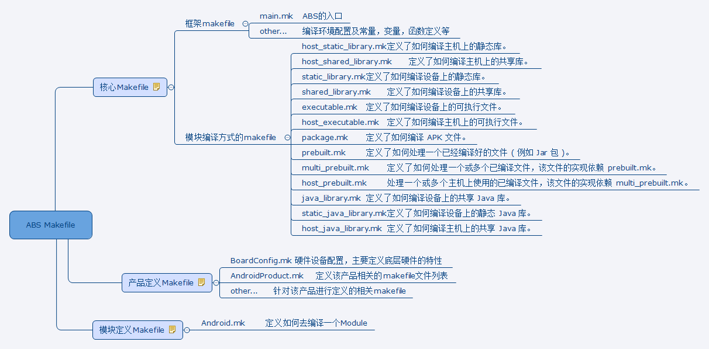

> 本文配套视频：http://www.toutiao.com/i6432821122323972610/

## 1.源码级开发（系统开发）

源码级开发就是基于AOSP（Android Open Source Project）环境的开发工作，主要开发场景为Android系统定制，比如手机设备的MIUI,Flyme，Smartisan OS,基于电视的LetvUI，甚至还有针对投影仪，路由器等传统物联设备的Android系统定制开发。

### 1.1 Android系统分层

HAL层：（Hardware Abstract Layer）硬件抽象层。Android系统里封装内核驱动程序的接口层。对上层提供接口，屏蔽底层驱动实现细节.

本来Linux内核可以负责驱动接口定义和驱动实现，但是受限于GNU License（开源感染性），如果厂商选择驱动接口和实现都在内核空间完成，就必须开放自己的驱动源代码。这是不符合厂商利益的（驱动包含核心硬件参数，与其他厂家竞争的法宝）。所以Google将Linux内核中跟底层硬件操作相关的逻辑封装成HAL层接口，厂商基于接口去实现，不直接在内核空间实现驱动。因为Android系统遵循Apache License，不强制开源。

### 1.2三方应用开发与源码级开发的区别

三方应用开发是基于Android SDK开发。主要技术方向为APP及混合APP开发，数据库，网络协议，应用架构等，服务于商业APP需求。

源码级开发是基于AOSP环境开发，主要技术方向为系统应用开发，Framework开发，底层浏览器内核开发，音视频编解码开发，虚拟机开发，底层驱动开发等。服务于系统定制需求。

### 1.3 AOSP官网

AOSP官网提供系统开发相关指导，比如源码的环境搭建，下载，编译，维护，更新版本，开放驱动的下载等。

## 2. Ubuntu系统安装与介绍

AOSP环境要求操作系统为Linux或者Mac OS。如果想在Window下进行AOSP开发，通过通过虚拟机软件安装一个Linux系统，比如Ubuntu或CentOS。一般不会虚拟Mac OS。
如果安装虚拟机进行AOSP开发，建议电脑的内存要在16G以上。
硬件要求：

### 2.1 安装虚拟机

VirtualBox为出自Oracle公司的开源免费虚拟机软件，[下载地址](https://www.virtualbox.org/)

VMWare为VMware公司提供的商业虚拟机软件，可以选用免费版VMware Workstation Player，[下载地址](http://www.vmware.com/products/player/playerpro-evaluation.html)

### 2.2 Ubuntu系统的安装与介绍

Ubuntu系统是开发使用比较广泛的一个Linux发行版。[下载地址](http://releases.ubuntu.com)
截止2016年底，目前AOSP开发比较稳定的版本是14.04 LTS。带LTS（ Long Term Support），代表是官方长期维护的版本。

不同版本的AOSP，所推荐的Ubuntu系统版本也不同。具体要求如下：

## 3. 常见Linux命令

Linux命令是对Linux系统进行管理的命令。对于Linux系统来说，无论是中央处理器、内存、磁盘驱动器、键盘、鼠标，还是用户等都是文件。命令就是去操作文件，以达到管理系统的目的。

Linux包含系统内置shell命令（比如cd）及安装的其他Linux命令（比如git）。

相比Window系统的强项-图形化，Linux的命令则是它的强项。熟练掌握常见Linux命令，是做Linux环境下开发的基本技能。

PS：Linux命令大部分在Mac OS 下也是通用的，它们都属于类Unix系统。

### 3.1目录操作

| 命令    | 功能                                       |
| :---- | :--------------------------------------- |
| pwd   | 获取当前目录路径                                 |
| ls    | 查看文件列表 eg: ls dirname                    |
| -a    | 查看所有文件，包括隐藏文件                            |
| -l    | 查看文件详细信息                                 |
| (.)   | 代表当前目录                                   |
| (..)  | 代表上一级目录                                  |
| cd    | 进入某一个目录 eg: cd dirname                   |
| cd .. | 进入上一级目录                                  |
| cd -  | 进入上次所在目录                                 |
| mkdir | 创建目录                                     |
| -p    | 创建多级目录                                   |
| cp    | 拷贝文件或者目录 eg: cp src1 src2... dest        |
| -r    | 拷贝目录 eg: cp -r src dest                  |
| mv    | 移动文件或者目录 eg:mv src dest (如果srcfile和destfile在同一目录下，就是重命名的效果) |
| rm    | 删除文件 eg: rm filename1 filename2 ...      |
| -r    | 删除目录 eg: rm -r dirname                   |

### 3.2文件查找

| 命令   | 功能                                       |
| ---- | ---------------------------------------- |
| find | 查找某一个文件，find [path] -name &lt;filename>  |
| grep | 从某一个文件/目录下所有文件 中匹配字符串，grep [-r -n ]&lt;string> path |
| -r   | 遍历目录查找                                   |
| -n   | 显示行号                                     |

### 3.3系统操作

| 命令      | 功能                                       |
| ------- | ---------------------------------------- |
| su      | 切换到某一个用户(需要输入要切换的用户的密码) eg: su username  |
| sudo    | 非root用户强制执行一些需要root权限的操作(需要输入当前用户的密码) eg: sudo rm filename |
| apt-get | Ubuntu的软件管家，进行软件的更新，卸载与维护。               |
| vim     | 终端下的文本编辑器。                               |
| i       | 进入编辑模式                                   |
| ESC     | 跳到命令模式                                   |
| dd      | 删除一行                                     |
| (:wq)   | 保存退出                                     |
| (:q!)   | 不保存退出                                    |
| cat     | 查看文件,将文本内容打印到控制台。                        |

```
# 安装VIM
sudo apt-get install vim
# 卸载VIM
sudo apt-get remove vim

# 更新到最新软件列表
sudo apt-get update
```

chmod

- 修改文件权限，eg：chmod a+x xxx.sh chmod 777 xxx.sh
- 权限设定可以使用字串\[ugoa]\[+-=][rwx]或者数字 (r=4,w=2,x=1,-=0)，
- u 拥有者
- g 用户组
- o 其他用户
- a 所有人
- \+ 表示增加权限
- \- 表示取消权限
- = 表示直接指定权限 

## 4. AOSP源码工作环境

源码工作环境，就是安装所依赖的一些软件库，以及开发调试时需要进行的一些配置。
主要分为编译环境准备，AOSP源码下载，源码预编译等。这里主要介绍在Ubuntu14.04 LTS下开发Android6.0代码的工作环境准备。

### 4.1编译环境搭建（Ubuntu14.04）

JDK和依赖包下载

```
$ sudo apt-get update #获取源的更新
$ sudo apt-get install openjdk-7-jdk #下载openjdk7
```
sunjdk 采用Java研究许可（Java Research License，简称JRL）许可证书，部分开源，仅限研究。openjdk采用GNU许可证书，完全开源。sunjdk中私有APIs用类似功能的开源代码替换/重新实现。Google为了解决与Oracal公司的版权纠纷，在Android 5.0以后JavaAPIS替换为openjdk。不同版本的AOSP代码，所要求的JDK版本也不一样，详附：

安装其他依赖

```
$ sudo apt-get install git-core gnupg flex bison gperf build-essential zip curl zlib1g-dev gcc-multilib g++-multilib libc6-dev-i386 lib32ncurses5-dev x11proto-core-dev libx11-dev lib32z-dev ccache libgl1-mesa-dev libxml2-utils xsltproc unzip
```

不同版本的Ubuntu系统所需要安装的依赖也是不一样的，在一些低版本即使按照官方文档做，编译的时候也会出现很多错误，所以建议使用Google推荐的Ubuntu系统版本。

**USB设备权限配置**

在 GNU/Linux系统下（比如Ubuntu），普通用户默认是没有权限去访问USB设备的，如果希望某个用户访问，可以以root身份在/etc/udev/rules.d/ 目录下创建一个rules规则文件，AOSP提供的rules里配置了常见Android设备。

```
# 下载并配置AOSP的usb设备权限规则模板
$ wget -S -O - [http://source.android.com/source/51-android.rules](http://source.android.com/source/51-android.rules) | sed "s/<username>/$USER/" | sudo tee >/dev/null /etc/udev/rules.d/51-android.rules; sudo udevadm control --reload-rules
```

上述模板只配置了一些Nexus设备，如果是自己的Android设备，执行adb devices的时候可能会提示permission denied，原因就是因为自己的Android设备没有加入到这个配置文件当中。可以利用lsusb命令列出当前系统识别到的USB设备：
$lsusb #获取当前的usb设备，输出类似以下的信息

```
Bus 001 Device 007: ID 0403:cb48 Future Technology Devices International, Ltd
Bus 001 Device 006: ID 0461:4d15 Primax Electronics, Ltd Dell Optical Mouse
Bus 001 Device 001: ID 1d6b:0002 Linux Foundation 2.0 root hub
```

找出自己的手机设备，以第一行为例，idVendor是0403,idProduct是cb48。
可以在51-android.rules里新增一行：

```
SUBSYSTEM=="usb", ATTR{idVendor}=="0403", ATTR{idProduct}=="cb48", MODE="0600", OWNER="<username>"
```

记得要把&lt;username>替换为自己的登录用户名。然后再执行：
```
$sudo udevadm control --reload-rules#重新加载USB访问规则
```

然后重新插拔USB设备即可。

**OUT目录配置（可选）**

ASOP代码编译以后默认会在你当前工作目录创建/out目录，编译产出的所有文件都会放在这个目录。编译完以后这个目录大小比AOSP源码还要大，如果希望自定义out目录的位置：

```
# export：配置环境变量
# OUT_DIR_COMMON_BASE：环境变量名，配置保存编译AOSP源码所生成文件的out目录位置。默认在AOSP源码的目录下。仅支持4.1及以后
$ export OUT_DIR_COMMON_BASE=<path-to-your-out-directory>
```

**设置ccache缓存（可选）**

开启ccache，在AOSP编译的过程中，会对C/C++代码的编译结果进行缓存。当执行了make clean命令以后，再次执行make编译的时候，可以大大提高编译速度。
```
$ export USE_CCACHE=1 #开启CCACHE。此配置可以提高二次全编译的速度。可以添加到.bashrc文件中，
$ export CCACHE_DIR=/<path_of_your_choice>/.ccache #设置缓存目录的路径。也可以添加到.bashrc文件中，
$ prebuilts/misc/linux-x86/ccache/ccache -M 50G #设置缓存目录的大小。这个配置一次即可。
```
.bashrc是home目录下的一个脚本文件，每打开一个终端窗口，这个启动脚本里的命令就会执行，相当于开机启动。

### 4.2源码下载与管理

AOSP源码下载
由于国内的网络限制，以下执行的命令，有些会将访问的Google地址替换为国内的镜像网站，比如清华镜像源。镜像源：定期同步Google的AOSP代码服务器，供国内网络访问。

```
# 1. 下载repo

# 创建~/bin目录并加到环境变量

$ mkdir ~/bin
$ PATH=~/bin:$PATH

# 下载repo脚本到本地并配置可执行权限

$ curl [https://storage.googleapis.com/git-repo-downloads/repo](https://storage.googleapis.com/git-repo-downloads/repo) > ~/bin/repo

# 清华大学提供的repo

# curl [https://mirrors.tuna.tsinghua.edu.cn/git/git-repo](https://mirrors.tuna.tsinghua.edu.cn/git/git-repo) > ~/bin/repo

# export REPO_URL='[https://mirrors.tuna.tsinghua.edu.cn/git/git-repo/](https://mirrors.tuna.tsinghua.edu.cn/git/git-repo/)'

$ chmod a+x ~/bin/repo #所有用户可执行

# 2. 初始化本地repo

# 创建工作目录，用于保存下载的AOSP源码

$ mkdir WORKING_DIRECTORY
$ cd WORKING_DIRECTORY

# 配置git账户信息，用于提交代码到Gerrit(code-review代码审查)上

$ git config --global user.name "Your Name"
$ git config --global user.email "you@example.com"

# 初始化repo，指定要下载的android源码分支名。不指定，默认下载master分支代码(最新版本代码)。执行完以后WORKING_DIRECTORY下会生成.repo目录。

$ repo init -u [https://android.googlesource.com/platform/manifest](https://android.googlesource.com/platform/manifest) -b android-6.0.1_r78

# 清华大学提供的AOSP镜像网站

# repo init -u [https://aosp.tuna.tsinghua.edu.cn/platform/manifest](https://aosp.tuna.tsinghua.edu.cn/platform/manifest) -b android-6.0.1_r78

# 3.下载，同步。会将repo所维护的服务器上对应分支的所有project的.git仓库更新下载到本地并checkout代码到WORKING_DIRECTORY目录

$ repo sync
```
repo与git的关系

AOSP：本质上是一堆使用git进行版本控制的project。
repo：针对AOSP大量git仓库的管理工具。可以执行批量git同步，更新，提交等操作。

原理：通过读取manifest.git里维护的manifests.xml文件当中配置的projects的git仓库地址，分支等信息执行git操作。将服务器上按照特定目录结构保存的project原封不动的同步到本地。

关系：repo基于git，让超大型的项目代码管理更有效率。

manifest.xml文件解释：
```xml
<?xml version="1.0" encoding="UTF-8"?>

<manifest>
<remote fetch="https://android.googlesource.com" name="aosp" review="android-review.googlesource.com" revision="refs/tags/android-6.0.1_r74" />
<!-- 可以配置多个remote -->
<remote name="repo_remote" fetch="." />
<!-- 配置git remote 远程服务器信息 -->
<!-- name ，远程服务器的名字 -->
<!--fetch: 以下projects仓库地址的公共前缀。如果是（.）(..)，则是相对路径形式（相对manifest.git）比如：aosp的manifest的仓库地址为https://android.googlesource.com/platform/manifest 配置..代表公共前缀为https://android.googlesource.com/ 配置.代表公共前缀为https://android.googlesource.com/platform ${remote_fetch}/${project_name}.git 组成git仓库的remote url -->
<!-- project 默认的配置 -->
<default revision="master" remote="repo_remote" sync-j="4" />
<!-- revision：project 节点默认的revision值 remote：project 节点默认的remote值 sync-j： 执行repo sync -j的参数值。多任务 -->
<project path="build/project1" name="project1" remote="repo_remote" revision="master"/>
<!-- path：告诉repo，project1代码下载下来保存在WORK_DIR下的那个目录） name：服务器仓库的名字。拼接在remote_fetch 的后面，组成git服务器仓库的remote url地址。 remote: 告诉repo，project1的remote是走那一个<remote>节点的配置 revision: 告诉repo，下载这个Git project 的那个分支 -->
<project path="project1" name="project1" remote="repo_remote" revision="master"/>
</manifest>
```
### 4.3源码预编译

驱动下载（可选）

如果要使用Nexus设备进行学习，则需要下载Nexus的驱动，再进行编译。[驱动下载地址](https://developers.google.com/android/nexus/drivers) 找到对应设备的驱动，下载到工作目录解压后为.sh结尾的脚本，执行后会将驱动安装在vendor/目录下
如果之前编译过AOSP，则需要删除所有编译结果，重新编译。
```
$make clobber #删除out目录下的内容。
```
编译AOSP

```
# 1.初始化编译环境 source或者(.)都可以执行一个shell脚本
$ source build/envsetup.sh
$ . build/envsetup.sh

# 2.选择编译目标
$ lunch aosp_arm-eng #模拟器

# 3.开始编译 -jN:job，开多少个任务去执行编译。
$make -j4
```

lunch BUILD-BUILDTYPE解释：

BUILD为内部开发代码，比如Nexus 6P为aosp_angler
BUILDTYPE为编译类型。不同的编译类型，在编译过程中会有不同的编译配置。
user：类似MIUI发布的的稳定版ROM。会关闭一些调试性的配置。比如adb。
userdebug：类似MIUI发布的开发版ROM。跟user版本差不多，但是具备root，方便进行测试。
eng：内部开发版。包含开发过程中使用到的测试工具，带root。

运行编译结果

如果是模拟器，可直接运行emulator 命令。

```
$ emulator
```

如果是硬件设备，需要进入bootloader模式将镜像文件通过fastboot烧写到设备上。

```
$adb reboot bootloader #进入bootloader模式
$fastboot flash system system.img #烧写system分区
$fastboot reboot #重启设备
```

### 知识扩展

刷机

刷机，手机方面的专业术语，是指通过一定的方法更改或替换手机中原本存在的一些语言、图片、铃声、软件或者操作系统。通俗来讲，刷机就是给手机重装系统。刷机可以使手机的功能更加完善，并且可以使手机还原到原始状态。一般情况下Android手机出现系统被损坏，造成功能失效或无法开机，也通常通过刷机来解决。一般Andriod手机刷机分为线刷，卡刷，软刷和厂刷。

卡刷：进入recovery模式刷机。将ROM包（一般为zip,bin格式）放到SD卡目录下，手机重启到recovery模式下进行刷机的方式。所谓的OTA（Over-the-Air Technology）升级，指的就是这个。

线刷：进入bootloader模式刷机。通过USB线连接Android设备，在电脑上通过adb、fastboot等工具（或特定手机的线刷工具，比如MiFlash）直接将镜像文件（一般为img格式）/打包后的镜像包(一般为bin格式)烧写到对应分区的方式。

Android系统常用分区

| 分区名        | 介绍                                       |
| ---------- | ---------------------------------------- |
| bootloader | 相当于PC的BIOS，负责硬件自检和初始化，以及启动模式选择。在bootloader模式下可以进行分区的烧写。 |
| recovery   | 包含Linux内核和recovery程序，简易的linux系统。在recovery模式下可以进行分区的擦写，OTA升级操作。 |
| boot       | 包含Linux内核和一个迷你的根文件系统。负责system、cache、userdata等分区的挂载。 |
| system     | 常规的Android系统所在分区。挂载在/system目录下，包含系统APK，framework层的jar/so/bin等所有AOSP编译输出产物。 |
| userdata   | 用户数据分区。挂载在/data目录下。用户安装的APK，以及app的数据都在这个分区。 |
| cache      | 缓存分区，一般用于OTA升级进入recovery前，临时放置OAT升级包，以及保存OTA升级的一些临时输出文件。 |
| sdcard     | 外置存储。内置sdcard一般挂载在/sdcard                |

out目录

out目录：编译过程中生成的文件以及最终生成的文件所在目录。 
/out/host/：该目录下包含了针对当前操作系统所编译出的 Android 开发工具产物。例如：adb，aapt,fastboot等命令。
/out/target/common/：该目录下包含了针对Android设备的通用的编译产物，主要是 Java 应用代码和 Java 库。(framework.jar,services.jar,android.policy.jar等等)
/out/target/product/&lt;product_name>/：包含了针对特定设备的编译结果以及平台相关的 C/C++ 库和二进制文件。其中，&lt;product_name>是具体目标设备的名称。

Build 的产物中最重要的是三个镜像文件，它们都位于 /out/target/product/目录下。
ramdisk.img：在启动时将被 Linux 内核挂载为只读分区，它包含了 /init 文件和一些配置文件。它用来挂载其他系统镜像并启动 init 进程。

system.img：包含了 Android OS 的系统文件，库，可执行文件以及预置的应用程序，将被挂载为system分区。
userdata.img：将被挂载为 /data，包含了应用程序相关的数据以及和用户相关的数据。

### 4.4 AOSP常见的命令，目录介绍

常见AOSP命令
在envsetup.sh里定义的一些shell函数。

| 命令      | 解释                                       |
| :------ | :--------------------------------------- |
| gettop  | 获取WORKING_DIRECTORY目录的完整路径               |
| croot   | 回到WORKING_DIRECTORY目录                    |
| mm      | 编译当前目录下的模块。比如在packages/apps/Calculator目录下执行mm,就是编译Calculator.apk。 |
| cgrep   | 执行grep命令，但只匹配C/C++的源文件。                  |
| jgrep   | 执行grep命令，但只匹配java源文件。                    |
| resgrep | 执行grep，但只匹配路径名为res/下的xml资源文件。            |
| godir   | 去某一个目录。第一次执行会将AOSP的所有目录路径存到filelist文件中。类似everythings的作用。 |

常见AOSP目录

介绍一些做AOSP开发时，一般会接触到的目录。

```
目录名 介绍
build/ ├─ core/ AOSP整个编译过程中核心的编译规则makefile
├─ envsetup.sh 编译环境初始化脚本
├─ target/ AOSP自带的Target（模拟器）的一些makefile
└─ tools / 编译中使用的shell及python写的工具脚本
packages/ 电话，桌面，设置，相册，照相机，闹铃，日历等经常操作的系统app,以及一些provider，输入法等桌面上看不到的app。
frameworks/av/ 多媒体相关的native层的源码目录
framework/webview 浏览器内核chromium的源码目录
framework/native power,surface,input，binder等服务的native层实现的源码目录
frameworks/base/ ├─core framework.jar ,framework-res.apk,libandroid_runtime.so等的源文件
├─native libandroid.so的源代码目录。java api的native实现。比如assertmanager，looper等。
├─media 多媒体相关的JavaAPI及JNI层的源文件
├─packages SettingsProvider，SystemUI等不在桌面直接启动的APP的源码目录
├─services services.jar，libandroid_servers.so的源文件
└─wifi wifi服务相关的Java API，WifiManager,WifiService等
device/<vendor_name>/<product_name> 跟某些厂商的某个硬件平台相关的内核，硬件配置等
vendor/<vendor_name>/<product_name> 厂商对AOSP进行的修改或者定制，放在vendor目录。包括但不限于framework层新增API，新增APP等业务需求。但是现在Google更推荐放在devices目录下。
```

## 5. Android Build System入门

Android Build 系统用来编译 Android 系统，Android SDK 以及相关文档。该系统主要由 Make 文件，Shell 脚本以及 Python 脚本组成，在编译时能够支持面向不同的硬件设备，不同的编译类型，且提供面向各个厂商的定制扩展。

### 5.1 什么是makefile



makefile是一些有特定语法的，可供make命令读取并执行的脚本性质的配置文件。作用就是可以告知编译系统，对哪些源文件进行编译，怎么编译，怎么处理依赖关系。makefile可以定义变量，函数，调用系统命令，shell/python脚本，管理module之间的依赖。整个 Android Build 系统中的 Make 文件可以分为三类:

- Build系统核心Makefile

这类makefile定义了整个 Build 系统的框架，而其他所有 Make 文件都是在这个框架的基础上编写出来的。位于/build/core目录下.

- 针对某个产品的Makefile

这类makefile是针对某个产品Make 文件，这些文件通常位于 device/&lt;vendor>/&lt;product> 目录下。

- 针对某个模块的Makefile-Android.mk

第三类是针对某个模块的 Make 文件。AOSP中，不会针对某一个文件进行编译，每一个编译单位都是一个模块，每个模块由一个名为“Android.mk”的makefile来声明。该文件中定义了如何编译当前模块。

### 5.2 ABS的工作流程

[参考文档](https://sites.google.com/a/itspaclub.com/www/android/android-build-system-anatomy)

## 6.AOSP下进行系统开发

从系统APP开发，Framework层定制，native层定制三个环节，学会如何修改AOSP代码达到开发需求。

### 6.1 Android的启动流程简述

AOSP开发的覆盖面是非常广的，从上层的系统APP到底层的HAL层驱动，每一个环节都是息息相关的。我们不可能一下子就能打通任督二脉，但是了解Android的启动流程，会帮助我们加深对Andorid系统的理解。

### 6.2修改系统APP代码

系统开发，很大一部分人员会从事系统APP定制的工作。

- 如何去编译APK

在源码环境下，使用mm命令编译module，APK会输出到out/target/product/product_name目录下。

mm –B :强制重新编译。相当于clean后再编译。

- Dalvik与ART的区别

Dalvik：JIT（Just-in-time）实时编译，运行的时候将字节码翻译成机器码，所运行的目标文件（dex）与硬件平台无关，APP运行效率较低。

ART：AOT (Ahead-Of-Time - 预先编译)，运行前将字节码翻译成机器码，所运行的目标文件（oat）与硬件平台相关。APP运行效率高，但会占用空间。APK安装所需时间增加。

- odex是干什么的

dalvik时代：APK运行的时候，会把APK中的classes.dex解压出来并通过dexopt优化为成.odex文件，缓存在/data/dalvick-cache目录下，提高后续执行的效率。

ART时代：APK安装的时候，会把APK中的classes.dex解压后，通过dex2oat工具转化为.odex文件（ELF格式），存储在apk所在目录的oat目录下。

为什么在源码环境下编译就产出了odex文件
ROM：apk，jar，bin，so等组成。

优点：

1. 降低系统更新后启动的时间。

未odex的Rom，首次开机的过程中会执行odex操作。编译时做，开机时候就不用做了。

2. 减少在设备上进行odex操作所造成的空间浪费。

编译时dexopt/dex2oat，会直接将APK的资源与代码拆开。如果在设备上安装时dexopt/dex2oat，apk的大小不会减少，但又会多一个odex文件占据磁盘空间。

缺点：

3. 增加开发时编译的时间

4. 不能直接执行APK的install操作，需要将APK和odex都sync到设备上。

- 如何在开发阶段关闭dex2oat

在当前module的Android.mk里关闭，LOCAL_DEX_PREOPT = false
在build/core/main.mk中关闭所有module的dex优化

```
## eng
ifeq ($(TARGET_BUILD_VARIANT),eng)
tags_to_install := debug eng

# 关闭odex优化
WITH_DEXPREOPT := false
```

Odex优化只在Linux环境下生效。

### 6.3定制framework

framework的定制，一般是为了满足APP层或者整个系统的某一种需求。

需求1：在系统所有的服务启动之前，打印一句日志，模拟对系统行为的修改。

SystemServer.java ---> services.jar stop;start重启Android系统生效

需求2：在App层调用Log.wtf打印日志，当TAG=“ITCAST”的时候，在Framework层修改Log的输出结果。

android.util.Log.java ---> framework.jar stop;start重启Android系统生效

### 6.4进一步修改native层的代码

native层的定制，一般是为了满足framework层代码的调用需求。Native层分为两部分，JNI-native。JNI层是native层C/C++与framework层Java交互的桥梁。

需求：在打印日志TAG=“ITCAST”的时候，在JNI层和native层分别修改Log的输出结果。

android_util_Log.cpp ---> libandroid_runtime.so stop;start重启Android系统生效

logd_write.c ---> liblog.so 重启设备生效

## 7.源码级开发的职业发展

工作岗位：

- 系统APP开发工程师(系统应用)
- Framework开发工程师（安全，图像，电话，系统服务，浏览器内核，多媒体等）
- Android系统架构师（Android系统定制，ABS定制，升级，维护）

技术储备：C/C++,Shell,Python,Smali等