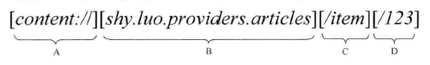

上文简要介绍了[Android](http://lib.csdn.net/base/android)应用程序组件Content Provider在应用程序间共享数据的原理，但是没有进一步研究它的实现。本文将实现两个应用程序，其中一个以Content Provider的形式来提供数据访问入口，另一个通过这个Content Provider来访问这些数据。本文的例子不仅可以为下文分析Content Provider的实现原理准备好使用情景，还可以学习到它的一个未公开接口。

《[android](http://lib.csdn.net/base/android)系统源代码情景分析》一书正在进击的程序员网（[http://0xcc0xcd.com](http://0xcc0xcd.com/)）中连载，点击进入！

本文中的应用程序是按照上一篇文章[Android应用程序组件Content Provider简要介绍和学习计划](http://blog.csdn.net/luoshengyang/article/details/6946067)中提到的一般应用程序[架构](http://lib.csdn.net/base/architecture)方法来设计的。本文包含两个应用程序，其中，第一个应用程序命名为ArticlesProvider，它使用了SQLite[数据库](http://lib.csdn.net/base/mysql)来维护一个文章信息列表，同时，它定义了访问这个文章信息列表的URI，这样，我们就可以通过一个Content Provider组件来向第三方应用程序提供访问这个文章信息列表的接口；第二个应用程序命名为Article，它提供了管理保存在ArticlesProvider应用程序中的文章信息的界面入口，在这个应用程序中，用户可以添加、删除和修改这些文章信息。接下来我们就分别介绍这两个应用程序的实现。

## 1.ArticlesProvider应用程序的实现

首先是参照[在Ubuntu上为Android系统内置Java应用程序测试Application Frameworks层的硬件服务](http://blog.csdn.net/luoshengyang/article/details/6580267)一文，在packages/experimental目录下建立工程文件目录ArticlesProvider。在继续介绍这个应用程序的实现之前，我们先介绍一下这个应用程序用来保存文章信息的数据库的设计。

我们知道，在Android系统中，内置了一款轻型的数据库SQLite。SQLite是专门为[嵌入式](http://lib.csdn.net/base/embeddeddevelopment)产品而设计的，它具有占用资源低的特点，而且是开源的，非常适合在Android平台中使用，关于SQLite的更多信息可以访问官方网站[http://www.sqlite.org](http://www.sqlite.org/)。

ArticlesProvider应用程序就是使用SQLite来作为数据库保存文章信息的，数据库文件命名为Articles.db，它里面只有一张表ArticlesTable，表的结构如下所示：

| 字段1  | 字段2    | 字段3       | 字段4  |
| :--- | :----- | :-------- | :--- |
| _id  | _title | _abstract | _url |

它由四个字段表示，第一个字段**_id**表示文章的ID，类型为自动递增的integer，它作为表的key值；第二个字段**_title**表示文章的题目，类型为text；第三个字段**_abstract**表示文章的摘要，类型为text；第四个字段**_url**表示文章的URL，类型为text。注意，当我们打算将数据库表的某一列的数据作为一个数据行的ID时，就约定它的列名为**_id**。这是因为我们经常需要从数据库中获取一批数据，这些数据以Cursor的形式返回，对这些返回来的数据我们一般用一个ListView来显示，而这个ListView需要一个数据适配器Adapter来作为数据源，这时候就我们就可以以这个Cursor来构造一个Adapter。有些Adapter，例如android.widget.CursorAdapter，它们在实现自己的getItemId成员函数来获取指定数据行的ID时，就必须要从这个Cursor中相应的行里面取出列名为`_id`的字段的内容出来作为这个数据行的ID返回给调用者。当然，我们不在数据库表中定义这个`_id`列名也是可以的，不过这样从数据库中查询数据后得到的Cursor适合性就变差了，因此，建议我们在设计数据库表时，尽量设置其中一个列名字`_id`，并且保证这一列的内容是在数据库表中是唯一的。

下面我们就开始介绍这个应用程序的实现了。这个应用程序只有两个源文件，分别是Articles.Java和ArticlesProvider，都是放在shy.luo.providers.articles这个package下面。在Articles.java文件里面，主要是定义了一些常量，例如用来访问文章信息数据的URI、MIME（Multipurpose Internet Mail Extensions）类型以及格式等，这些常量是第三方应用程序访问这些文章信息数据时要使用到的，因此，我们把它定义在一个单独的文件中，稍后我们会介绍如果把这个Articles.java文件打包成一个jar文件，然后第三方应用程序就可以引用这个常量了，这样也避免了直接把这个源代码文件暴露给第三方应用程序。

源文件Articles.java位于src/shy/luo/providers/articles目录下，它的内容如下所示：

```java
package shy.luo.providers.articles;  
  
import android.net.Uri;  
  
public class Articles {  
/*Data Field*/  
public static final String ID = "_id";  
public static final String TITLE = "_title";  
public static final String ABSTRACT = "_abstract";  
public static final String URL = "_url";  
  
/*Default sort order*/  
public static final String DEFAULT_SORT_ORDER = "_id asc";  
  
/*Call Method*/  
public static final String METHOD_GET_ITEM_COUNT = "METHOD_GET_ITEM_COUNT";  
public static final String KEY_ITEM_COUNT = "KEY_ITEM_COUNT";  
  
/*Authority*/  
public static final String AUTHORITY = "shy.luo.providers.articles";  
  
/*Match Code*/  
public static final int ITEM = 1;  
public static final int ITEM_ID = 2;  
public static final int ITEM_POS = 3;  
  
/*MIME*/  
public static final String CONTENT_TYPE = "vnd.android.cursor.dir/vnd.shy.luo.article";  
public static final String CONTENT_ITEM_TYPE = "vnd.android.cursor.item/vnd.shy.luo.article";  
  
/*Content URI*/  
public static final Uri CONTENT_URI = Uri.parse("content://" + AUTHORITY + "/item");  
public static final Uri CONTENT_POS_URI = Uri.parse("content://" + AUTHORITY + "/pos");  
}  
```
ID、TITLE、ABSTRACT和URL四个常量前面已经解释过了，它是我们用来保存文章信息的数据表的四个列名；DEFAULT_SORT_ORDER常量是调用ContentProvider接口的query函数来查询数据时用的，它表示对查询结果按照_id列的值从小到大排列；METHOD_GET_ITEM_COUNT和KEY_ITEM_COUNT两个常量是调用ContentProvider接口的一个未公开函数call来查询数据时用的，它类似于微软COM中的IDispatch接口的Invoke函数，使用这个call函数时，传入参数METHOD_GET_ITEM_COUNT表示我们要调用我们自定义的ContentProvider子类中的getItemCount函数来获取数据库中的文章信息条目的数量，结果放在一个Bundle中以KEY_ITEM_COUNT为关键字的域中。

剩下的常量都是跟数据URI相关的，这个需要详细解释一下。URI的全称是Universal Resource Identifier，即通用资源标志符，通过它用来唯一标志某个资源在网络中的位置，它的结构和我们常见的HTTP形式URL是一样的，其实我们可以把常见的HTTP形式的URL看成是URI结构的一个实例，URI是在更高一个层次上的抽象。在Android系统中，它也定义了自己的用来定痊某个特定的Content Provider的URI结构，它通常由四个组件来组成，如下所示：



A组件称为Scheme，它固定为content://，表示它后面的路径所表示的资源是由Content Provider来提供的。

B组件称为Authority，它唯一地标识了一个特定的Content Provider，因此，这部分内容一般使用Content Provider所在的package来命名，使得它是唯一的。

C组件称为资源路径，它表示所请求的资源的类型，这部分内容是可选的。如果我们自己所实现的Content Provider只提供一种类型的资源访问，那么这部分内部就可以忽略；如果我们自己实现的Content Provider同时提供了多种类型的资源访问，那么这部分内容就不可以忽略了。例如，我们有两种电脑资源可以提供给用户访问，一种是笔记本电脑，一种是平板电脑，我们就把分别它们定义为notebook和pad；如果我们想进一步按照系统类型来进一步细分这两种电脑资源，对笔记本电脑来说，一种是安装了windows系统的，一种是安装了[Linux](http://lib.csdn.net/base/linux)系统的，我们就分别把它们定义为notebook/windows和notebook/[linux](http://lib.csdn.net/base/linux)；对平板电脑来说，一种是安装了[iOS](http://lib.csdn.net/base/ios)系统的，一种是安装了android系统的，我们就分别把它们定义为pad/[ios](http://lib.csdn.net/base/ios)和pad/android。

D组件称为资源ID，它表示所请求的是一个特定的资源，它通常是一个数字，对应前面我们所介绍的数据库表中的_id字段的内容，它唯一地标志了某一种资源下的一个特定的实例。继续以前面的电脑资源为例，如果我们请求的是编号为123的装了android系统的平板电脑，我们就把它定义为pad/android/123。当忽略这部分内容时，它有可能是表示请求某一种资源下的所有实例，取决于我们的URI匹配规则，后面我们将会进一步解释如何设置URI匹配规则。

回到上面的Articles.java源文件中，我们定义了两个URI，分别用COTENT_URI和CONTENT_POS_URI两个常量来表示，它们的Authority组件均指定为shy.luo.providers.articles。其中，COTENT_URI常量表示的URI表示是通过ID来访问文章信息的，而CONTENT_POS_URI常量表示的URI表示是通过位置来访问文章信息的。例如，content://shy.luo.providers.articles/item表示访问所有的文章信息条目；content://shy.luo.providers.articles/item/123表示只访问ID值为123的文章信息条目；content://shy.luo.providers.articles/pos/1表示访问数据库表中的第1条文章信息条目，这条文章信息条目的ID值不一定为1。通过常量CONTENT_POS_URI来访问文章信息条目时，必须要指定位置，这也是我们设置的URI匹配规则来指定的，后面我们将会看到。

此外，我们还需要定义与URI对应的资源的MIME类型。每个MIME类型由两部分组成，前面是数据的大类别，后面定义具体的种类。在Content Provider中，URI所对应的资源的MIME类型的大类别根据同时访问的资源的数量分为两种，对于访问单个资源的URI，它的大类别就为vnd.android.cursor.item，而对于同时访问多个资源的URI，它的大类别就为vnd.android.cursor.dir。Content Provider的URI所对应的资源的MIME类型的具体类别就需要由Content Provider的提供者来设置了，它的格式一般为vnd.[company name].[resource type]的形式。例如，在我们的例子中，CONTENT_TYPE和COTENT_ITEM_TYPE两个常量分别定义了两种MIME类型，它们的大类别分别为vnd.android.cursor.dir和vnd.android.cursor.item，而具体类别均为vdn.shy.luo.article，其中shy.luo就是表示公司名了，而article表示资源的类型为文章。这两个MIME类型常量主要是在实现ContentProvider的getType函数时用到的，后面我们将会看到。

最后，ITEM、ITEM_ID和POS_ID三个常量分别定了三个URI匹配规则的匹配码。如果URI的形式为content://shy.luo.providers.articles/item，则匹配规则返回的匹配码为ITEM；如果URI的形式为content://shy.luo.providers.articles/item/#，其中#表示任意一个数字，则匹配规则返回的匹配码为ITEM_ID；如果URI的形式为#也是表示任意一个数字，则匹配规则返回的匹配码为ITEM_POS。这三个常量的用法我们在后面也将会看到。

这样，Articles.java文件的内容就介绍完了。下面我们再接着介绍位于src/shy/luo/providers/articles目录下的ArticlesProvider.java文件，它的内容如下所示：

```java
import java.util.HashMap;  
  
import android.content.ContentValues;  
import android.content.Context;  
import android.content.UriMatcher;  
import android.content.ContentProvider;  
import android.content.ContentUris;  
import android.content.ContentResolver;  
import android.database.Cursor;  
import android.database.sqlite.SQLiteDatabase;  
import android.database.sqlite.SQLiteDatabase.CursorFactory;  
import android.database.sqlite.SQLiteException;  
import android.database.sqlite.SQLiteOpenHelper;  
import android.database.sqlite.SQLiteQueryBuilder;  
import android.net.Uri;  
import android.os.Bundle;  
import android.text.TextUtils;  
import android.util.Log;  
  
public class ArticlesProvider extends ContentProvider {  
private static final String LOG_TAG = "shy.luo.providers.articles.ArticlesProvider";  
  
private static final String DB_NAME = "Articles.db";  
private static final String DB_TABLE = "ArticlesTable";  
private static final int DB_VERSION = 1;  
  
private static final String DB_CREATE = "create table " + DB_TABLE +  
                        " (" + Articles.ID + " integer primary key autoincrement, " +  
                        Articles.TITLE + " text not null, " +  
                        Articles.ABSTRACT + " text not null, " +  
                        Articles.URL + " text not null);";  
  
private static final UriMatcher uriMatcher;  
static {  
        uriMatcher = new UriMatcher(UriMatcher.NO_MATCH);  
        uriMatcher.addURI(Articles.AUTHORITY, "item", Articles.ITEM);  
        uriMatcher.addURI(Articles.AUTHORITY, "item/#", Articles.ITEM_ID);  
        uriMatcher.addURI(Articles.AUTHORITY, "pos/#", Articles.ITEM_POS);  
}  
  
private static final HashMap<String, String> articleProjectionMap;  
static {  
        articleProjectionMap = new HashMap<String, String>();  
        articleProjectionMap.put(Articles.ID, Articles.ID);  
        articleProjectionMap.put(Articles.TITLE, Articles.TITLE);  
        articleProjectionMap.put(Articles.ABSTRACT, Articles.ABSTRACT);  
        articleProjectionMap.put(Articles.URL, Articles.URL);  
}  
  
private DBHelper dbHelper = null;  
private ContentResolver resolver = null;  
  
@Override  
public boolean onCreate() {  
        Context context = getContext();  
        resolver = context.getContentResolver();  
        dbHelper = new DBHelper(context, DB_NAME, null, DB_VERSION);  
  
        Log.i(LOG_TAG, "Articles Provider Create");  
  
        return true;  
}  
  
@Override  
public String getType(Uri uri) {  
        switch (uriMatcher.match(uri)) {  
        case Articles.ITEM:  
                return Articles.CONTENT_TYPE;  
        case Articles.ITEM_ID:  
        case Articles.ITEM_POS:  
                return Articles.CONTENT_ITEM_TYPE;  
        default:  
                throw new IllegalArgumentException("Error Uri: " + uri);  
        }  
}  
  
@Override  
public Uri insert(Uri uri, ContentValues values) {  
        if(uriMatcher.match(uri) != Articles.ITEM) {  
                throw new IllegalArgumentException("Error Uri: " + uri);  
        }  
  
        SQLiteDatabase db = dbHelper.getWritableDatabase();  
  
        long id = db.insert(DB_TABLE, Articles.ID, values);  
        if(id < 0) {  
                throw new SQLiteException("Unable to insert " + values + " for " + uri);  
        }  
  
        Uri newUri = ContentUris.withAppendedId(uri, id);  
        resolver.notifyChange(newUri, null);  
  
        return newUri;  
}  
  
@Override  
public int update(Uri uri, ContentValues values, String selection, String[] selectionArgs) {  
        SQLiteDatabase db = dbHelper.getWritableDatabase();  
        int count = 0;  
  
        switch(uriMatcher.match(uri)) {  
        case Articles.ITEM: {  
                count = db.update(DB_TABLE, values, selection, selectionArgs);  
                break;  
        }  
        case Articles.ITEM_ID: {  
                String id = uri.getPathSegments().get(1);  
                count = db.update(DB_TABLE, values, Articles.ID + "=" + id  
                                + (!TextUtils.isEmpty(selection) ? " and (" + selection + ')' : ""), selectionArgs);  
                break;  
        }  
        default:  
                throw new IllegalArgumentException("Error Uri: " + uri);  
        }  
  
        resolver.notifyChange(uri, null);  
  
        return count;  
}  
  
@Override  
public int delete(Uri uri, String selection, String[] selectionArgs) {  
        SQLiteDatabase db = dbHelper.getWritableDatabase();  
        int count = 0;  
  
        switch(uriMatcher.match(uri)) {  
        case Articles.ITEM: {  
                count = db.delete(DB_TABLE, selection, selectionArgs);  
                break;  
        }  
        case Articles.ITEM_ID: {  
                String id = uri.getPathSegments().get(1);  
                count = db.delete(DB_TABLE, Articles.ID + "=" + id  
                                + (!TextUtils.isEmpty(selection) ? " and (" + selection + ')' : ""), selectionArgs);  
                break;  
        }  
        default:  
                throw new IllegalArgumentException("Error Uri: " + uri);  
        }  
  
        resolver.notifyChange(uri, null);  
  
        return count;  
}  
  
@Override  
public Cursor query(Uri uri, String[] projection, String selection, String[] selectionArgs, String sortOrder) {  
        Log.i(LOG_TAG, "ArticlesProvider.query: " + uri);  
  
        SQLiteDatabase db = dbHelper.getReadableDatabase();  
  
        SQLiteQueryBuilder sqlBuilder = new SQLiteQueryBuilder();  
        String limit = null;  
  
        switch (uriMatcher.match(uri)) {  
        case Articles.ITEM: {  
                sqlBuilder.setTables(DB_TABLE);  
                sqlBuilder.setProjectionMap(articleProjectionMap);  
                break;  
        }  
        case Articles.ITEM_ID: {  
                String id = uri.getPathSegments().get(1);  
                sqlBuilder.setTables(DB_TABLE);  
                sqlBuilder.setProjectionMap(articleProjectionMap);  
                sqlBuilder.appendWhere(Articles.ID + "=" + id);  
                break;  
        }  
        case Articles.ITEM_POS: {  
                String pos = uri.getPathSegments().get(1);  
                sqlBuilder.setTables(DB_TABLE);  
                sqlBuilder.setProjectionMap(articleProjectionMap);  
                limit = pos + ", 1";  
                break;  
        }  
        default:  
                throw new IllegalArgumentException("Error Uri: " + uri);  
        }  
  
        Cursor cursor = sqlBuilder.query(db, projection, selection, selectionArgs, null, null, TextUtils.isEmpty(sortOrder) ? Articles.DEFAULT_SORT_ORDER : sortOrder, limit);  
        cursor.setNotificationUri(resolver, uri);  
  
        return cursor;  
}  
    
@Override  
public Bundle call(String method, String request, Bundle args) {  
        Log.i(LOG_TAG, "ArticlesProvider.call: " + method);  
  
        if(method.equals(Articles.METHOD_GET_ITEM_COUNT)) {  
                return getItemCount();  
        }  
  
        throw new IllegalArgumentException("Error method call: " + method);  
}  
  
private Bundle getItemCount() {  
        Log.i(LOG_TAG, "ArticlesProvider.getItemCount");  
  
        SQLiteDatabase db = dbHelper.getReadableDatabase();  
        Cursor cursor = db.rawQuery("select count(*) from " + DB_TABLE, null);  
  
        int count = 0;  
        if (cursor.moveToFirst()) {  
                count = cursor.getInt(0);  
        }  
  
        Bundle bundle = new Bundle();  
        bundle.putInt(Articles.KEY_ITEM_COUNT, count);  
  
        cursor.close();  
        db.close();  
  
        return bundle;  
}  
  
private static class DBHelper extends SQLiteOpenHelper {  
        public DBHelper(Context context, String name, CursorFactory factory, int version) {  
                super(context, name, factory, version);  
        }  
  
        @Override  
        public void onCreate(SQLiteDatabase db) {  
                db.execSQL(DB_CREATE);  
        }  
  
        @Override  
        public void onUpgrade(SQLiteDatabase db, int oldVersion, int newVersion) {  
                db.execSQL("DROP TABLE IF EXISTS " + DB_TABLE);  
                onCreate(db);  
        }  
}  
}  
```
我们在实现自己的Content Provider时，必须继承于ContentProvider类，并且实现以下六个函数：

- onCreate()，用来执行一些初始化的工作
- query(Uri, String[], String, String[], String)，用来返回数据给调用者
- insert(Uri, ContentValues)，用来插入新的数据
- update(Uri, ContentValues, String, String[])，用来更新已有的数据
- delete(Uri, String, String[])，用来删除数据
- getType(Uri)，用来返回数据的MIME类型

这些函数的实现都比较简单，这里我们就不详细介绍了，主要解释五个要点。

第一点是我们在ArticlesProvider类的内部中定义了一个DBHelper类，它继承于SQLiteOpenHelper类，它用是用辅助我们操作数据库的。使用这个DBHelper类来辅助操作数据库的好处是只有当我们第一次对数据库时行操作时，系统才会执行打开数据库文件的操作。拿我们这个例子来说，只有第三方应用程序第一次调用query、insert、update或者delete函数来操作数据库时，我们才会真正去打开相应的数据库文件。这样在onCreate函数里，就不用执行打开数据库的操作，因为这是一个耗时的操作，而在onCreate函数中，要避免执行这些耗时的操作。

第二点是设置URI匹配规则。因为我们是根据URI来操作数据库的，不同的URI对应不同的操作，所以我们首先要定义好URI匹配规则，这样，当我们获得一个URI时，就能快速地判断出要如何去操作数据库。设置URI匹配规则的代码如下所示：

```java
private static final UriMatcher uriMatcher;  
static {  
      uriMatcher = new UriMatcher(UriMatcher.NO_MATCH);  
      uriMatcher.addURI(Articles.AUTHORITY, "item", Articles.ITEM);  
      uriMatcher.addURI(Articles.AUTHORITY, "item/#", Articles.ITEM_ID);  
      uriMatcher.addURI(Articles.AUTHORITY, "pos/#", Articles.ITEM_POS);  
}  
```
在创建UriMatcher对象uriMatcher时，我们传给构造函数的参数为UriMatcher.NO_MATCH，它表示当uriMatcher不能匹配指定的URI时，就返回代码UriMatcher.NO_MATCH。接下来增加了三个匹配规则，分别是content://shy.luo.providers.articles/item、content://shy.luo.providers.articles/item/#和content://shy.luo.providers.articles/pos/#，它们的匹配码分别是Articles.ITEM、Articles.ITEM_ID和Articles.ITEM_POS，其中，符号#表示匹配任何数字。

第三点是SQLiteQueryBuilder的使用。在query函数中，我们使用SQLiteQueryBuilder来辅助数据库查询操作，使用这个类的好处是我们可以不把数据库表的字段暴露出来，而是提供别名给第三方应用程序使用，这样就可以把数据库表内部设计隐藏起来，方便后续扩展和维护。列别名到真实列名的映射是由下面这个HashMap成员变量来实现的：

```java
private static final HashMap<String, String> articleProjectionMap;  
static {  
      articleProjectionMap = new HashMap<String, String>();  
      articleProjectionMap.put(Articles.ID, Articles.ID);  
      articleProjectionMap.put(Articles.TITLE, Articles.TITLE);  
      articleProjectionMap.put(Articles.ABSTRACT, Articles.ABSTRACT);  
      articleProjectionMap.put(Articles.URL, Articles.URL);  
}  
```
在上面的put函数中，第一个参数表示列的别名，第二个参数表示列的真实名称。在这个例子中，我们把列的别名和和真实名称都设置成一样的。

第四点是数据更新机制的使用。执行insert、update和delete三个函数时，都会导致数据库中的数据发生变化，所以这时候要通过调用ContentResolver接口的notifyChange函数来通知那些注册了监控特定URI的ContentObserver对象，使得它们可以相应地执行一些处理，例如更新数据在界面上的显示。在query函数中，最终返回给调用者的是一个Cursor，调用者获得这个Cursor以后，可以通过它的deleteRow或者commitUpdates来执行一些更新数据库的操作，这时候也要通知那些注册了相应的URI的ContentObserver来作相应的处理，因此，这里在返回Cursor之前，要通过Cursor类的setNotificationUri函数来把当前上下文的ContentResolver对象保存到Curosr里面去，以便当通过这个Cursor来改变数据库中的数据时，可以通知相应的ContentObserver来处理。不过这种用法已经过时了，即不建议通过这个Cursor来改变数据库的数据，要把Cursor中的数据看作是只读数据。这里调用Cursor类的setNotificationUri函数还有另外一个作用，我们注意到它的第二个参数uri，对应的是Cursor中的内容，当把这个uri传给Cursor时，Cursor就会注册自己的ContentObserver来监控这个uri对应的数据的变化。一旦这个uri对应的数据发生变化，这个Cursor对应的数据就不是再新的了，这时候就需要采取一些操作来更新内容了。

第五点我们实现了ContentProvider的call函数。这个函数是一个未公开的函数，第三方应用程序只有Android源代码环境下开发，才能使用这个函数。设计这个函数的目的是什么呢？我们知道，当我们需要从Content Provider中获得数据时，一般都是要通过调用它的query函数来获得的，而这个函数将数据放在Cursor中来返回给调用者。以前面一篇文章[Android应用程序组件Content Provider简要介绍和学习计划](http://blog.csdn.net/luoshengyang/article/details/6946067)中，我们提到，Content Provider传给第三方应用程序的数据，是通过匿名共享内存来传输的。当要传输的数据量大的时候，使用匿名共享内存来传输数据是有好处的，它可以减入数据的拷贝，提高传输效率。但是，当要传输的数据量小时，使用匿名共享内存来作为媒介就有点用牛刀来杀鸡的味道了，因为匿名共享内存并不是免费的午餐，系统创建和匿名共享内存也是有开销的。因此，Content Provider提供了call函数来让第三方应用程序来获取一些自定义数据，这些数据一般都比较小，例如，只是传输一个整数，这样就可以用较小的代价来达到相同的数据传输的目的。

至此，ArticlesProvider的源代码就分析完了，下面我们还要在AndroidManifest.xml文件中配置这个ArticlesProvider类才能正常使用。AndroidManifest.xml文件的内容如下所示：

```xml
<manifest xmlns:android="http://schemas.android.com/apk/res/android"  
package="shy.luo.providers.articles">  
<application android:process="shy.luo.process.article"  
android:label="@string/app_label"  
android:icon="@drawable/app_icon">  
<provider android:name="ArticlesProvider"  
android:authorities="shy.luo.providers.articles"  
android:label="@string/provider_label"  
android:multiprocess="false">  
</provider>  
</application>  
</manifest>  
```
在配置Content Provider的时候，最重要的就是要指定它的authorities属性了，只有配置了这个属性，第三方应用程序才能通过它来找到这个Content Provider。这要需要注意的，这里配置的authorities属性的值是和我们前面在Articles.java文件中定义的AUTHORITY常量的值是一致的。另外一个属性multiprocess是一个布尔值，它表示这个Content Provider是否可以在每个客户进程中创建一个实例，这样做的目的是为了减少进程间通信的开销。这里我们为了减少不必要的内存开销，把属性multiprocess的值设置为false，使得系统只能有一个Content Provider实例存在，它运行在自己的进程中。在这个配置文件里面，我们还可以设置这个Content Provider的访问权限，这里我们为了简单起见，就不设置权限了。有关Content Provider的访问权限的设置，可以参考[官方文档](http://developer.android.com/guide/topics/manifest/provider-element.html)

这个应用程序使用到的字符串资源定义在res/values/strings.xml文件中，它的内容如下所示：

```xml
<?xml version="1.0" encoding="utf-8"?>  
<resources>  
<string name="app_label">Articles Storage</string>  
<string name="provider_label">Articles</string>  
</resources>  
```
由于Content Provider类型的应用程序是没有用户界面的，因此，我们不需要在res/layout目录下为程序准备界面配置文件。

程序的编译脚本Android.mk的内容如下所示：

```
LOCAL_PATH:= $(call my-dir)  
include $(CLEAR_VARS)  

LOCAL_MODULE_TAGS := optional  

LOCAL_SRC_FILES := $(call all-subdir-java-files)  

LOCAL_PACKAGE_NAME := ArticlesProvider  

include $(BUILD_PACKAGE)  
```
下面我们就可以参照

如何单独编译Android源代码中的模块

一文来编译和打包这个应用程序了：

```
USER-NAME@MACHINE-NAME:~/Android$ mmm packages/experimental/ArticlesProvider      
USER-NAME@MACHINE-NAME:~/Android$ make snod   
```
这样，打包好的Android系统镜像文件system.img就包含我们这里所创建的ArticlesProvider应用程序了。

前面说过，在Articles.java文件中定义的常量是要给第三方应用程序使用的，那么我们是不是直接把这个源文件交给第三方呢？这样就显得太不专业了，第三方拿到这个文件后，还必须要放在shy/luo/providers/articles目录下或者要把这个Articles类所在的package改掉才能正常使用。正确的做法是把编译好的Articles.java文件打包成一个jar文件交给第三方使用。编译ArticlesProvider这个应用程序成功后，生成的中间文件放在out/target/common/obj/APPS/ArticlesProvider_intermediates目录下，我们进入到这个目录中，然后执后下面的命令把Articles.class文件提取出来：

```
USER-NAME@MACHINE-NAME:~/Android/out/target/common/obj/APPS/ArticlesProvider_intermediates$ jar -xvf classes.jar shy/luo/providers/articles/Articles.class  
```
然后再单独打包这个Articles.class文件：

```
USER-NAME@MACHINE-NAME:~/Android/out/target/common/obj/APPS/ArticlesProvider_intermediates$ jar -cvf ArticlesProvider.jar ./shy  
```
这样，我们得到的ArticlesProvider.jar文件就包含了Articles.java这个文件中定义的常量了，第三方拿到这个文件后，就可以开发自己的应用程序来访问我们在ArticlesProvider这个Content Provider中保存的数据了。接下来我们就介绍调用这个ArticlesProvider来获取数据的第三方应用程序Article。

## Article应用程序的实现

首先是参照前面的ArticlesProvider工程，在packages/experimental目录下建立工程文件目录Article。这个应用程序的作用是用来管理ArticlesProvider应用程序中保存的文章信息的，因此，它需要获得相应的Content Provider接口来访问ArticlesProvider中的数据。我们首先在工程目录Article下面创建一个libs目录，把上面得到的ArticlesProvider.jar放在libs目录下，后面我们在编译脚本的时候，再把它引用到工程上来。下面我们就开始分析这个应用程序的实现。

这个应用程序的主界面MainActivity包含了一个ListView控件，用来显示从ArticlesProvider中得到的文章信息条目，在这个主界面上，可以浏览、增加、删除和更新文章信息。当需要增加、删除或者更新文章信息时，就会跳到另外一个界面ArticleActivity中去执行具体的操作。为了方便开发，我们把每一个文章信息条目封装成了一个Article类，并且把与ArticlesProvider进交互的操作都通过ArticlesAdapter类来实现。下面介绍每一个类的具本实现。

下面是Article类的实现，它实现在src/shy/luo/Article.java文件中：

```java
package shy.luo.article;  
  
public class Article {  
private int id;  
private String title;  
private String abs;  
private String url;  
  
public Article(int id, String title, String abs, String url) {  
        this.id = id;  
        this.title = title;  
        this.abs = abs;  
        this.url = url;  
}  
  
public void setId(int id) {  
        this.id = id;  
}  
  
public int getId() {  
        return this.id;  
}  
  
public void setTitle(String title) {  
        this.title = title;  
}  
  
public String getTitle() {  
        return this.title;  
}  
  
public void setAbstract(String abs) {  
        this.abs = abs;  
}  
  
public String getAbstract() {  
        return this.abs;  
}  
  
public void setUrl(String url) {  
        this.url = url;  
}  
  
public String getUrl() {  
        return this.url;  
}  
}  
```
下面是ArticlesAdapter类的实现，它实现在src/shy/luo/ArticlesAdapter.java文件中：

```java
package shy.luo.article;  

import java.util.LinkedList;  

import shy.luo.providers.articles.Articles;  
import android.content.ContentResolver;  
import android.content.ContentUris;  
import android.content.ContentValues;  
import android.content.Context;  
import android.content.IContentProvider;  
import android.database.Cursor;  
import android.net.Uri;  
import android.os.Bundle;  
import android.os.RemoteException;  
import android.util.Log;  


public class ArticlesAdapter {  
private static final String LOG_TAG = "shy.luo.article.ArticlesAdapter";  

private ContentResolver resolver = null;  

public ArticlesAdapter(Context context) {  
        resolver = context.getContentResolver();  
}  

public long insertArticle(Article article) {  
        ContentValues values = new ContentValues();  
        values.put(Articles.TITLE, article.getTitle());  
        values.put(Articles.ABSTRACT, article.getAbstract());  
        values.put(Articles.URL, article.getUrl());  
      
        Uri uri = resolver.insert(Articles.CONTENT_URI, values);  
        String itemId = uri.getPathSegments().get(1);  
      
        return Integer.valueOf(itemId).longValue();  
}  

public boolean updateArticle(Article article) {  
        Uri uri = ContentUris.withAppendedId(Articles.CONTENT_URI, article.getId());  

        ContentValues values = new ContentValues();  
        values.put(Articles.TITLE, article.getTitle());  
        values.put(Articles.ABSTRACT, article.getAbstract());  
        values.put(Articles.URL, article.getUrl());  
      
        int count = resolver.update(uri, values, null, null);  
      
        return count > 0;  
}  

public boolean removeArticle(int id) {  
        Uri uri = ContentUris.withAppendedId(Articles.CONTENT_URI, id);  

        int count = resolver.delete(uri, null, null);  

        return count > 0;  
}  

public LinkedList<Article> getAllArticles() {  
        LinkedList<Article> articles = new LinkedList<Article>();  

        String[] projection = new String[] {  
                Articles.ID,  
                Articles.TITLE,  
                Articles.ABSTRACT,  
                Articles.URL  
        };  
      
        Cursor cursor = resolver.query(Articles.CONTENT_URI, projection, null, null, Articles.DEFAULT_SORT_ORDER);  
        if (cursor.moveToFirst()) {  
                do {  
                        int id = cursor.getInt(0);  
                        String title = cursor.getString(1);  
                        String abs = cursor.getString(2);  
                        String url = cursor.getString(3);  
      
                        Article article = new Article(id, title, abs, url);  
                        articles.add(article);  
                } while(cursor.moveToNext());  
        }  
      
        return articles;  
}  

public int getArticleCount() {  
        int count = 0;  

        try {  
                IContentProvider provider = resolver.acquireProvider(Articles.CONTENT_URI);  
                Bundle bundle = provider.call(Articles.METHOD_GET_ITEM_COUNT, null, null);  
                count = bundle.getInt(Articles.KEY_ITEM_COUNT, 0);  
        } catch(RemoteException e) {  
                e.printStackTrace();  
        }  
      
        return count;  
}  

public Article getArticleById(int id) {  
        Uri uri = ContentUris.withAppendedId(Articles.CONTENT_URI, id);  

        String[] projection = new String[] {  
                        Articles.ID,  
            Articles.TITLE,  
            Articles.ABSTRACT,  
            Articles.URL  
        };  
      
        Cursor cursor = resolver.query(uri, projection, null, null, Articles.DEFAULT_SORT_ORDER);  
      
        Log.i(LOG_TAG, "cursor.moveToFirst");  
      
        if (!cursor.moveToFirst()) {  
                return null;  
        }  
      
        String title = cursor.getString(1);  
        String abs = cursor.getString(2);  
        String url = cursor.getString(3);  
      
        return new Article(id, title, abs, url);  
}  

public Article getArticleByPos(int pos) {  
        Uri uri = ContentUris.withAppendedId(Articles.CONTENT_POS_URI, pos);  

        String[] projection = new String[] {  
                        Articles.ID,  
            Articles.TITLE,  
            Articles.ABSTRACT,  
            Articles.URL  
        };  
      
        Cursor cursor = resolver.query(uri, projection, null, null, Articles.DEFAULT_SORT_ORDER);  
        if (!cursor.moveToFirst()) {  
                return null;  
        }  
      
        int id = cursor.getInt(0);  
        String title = cursor.getString(1);  
        String abs = cursor.getString(2);  
        String url = cursor.getString(3);  
      
        return new Article(id, title, abs, url);  
}  
}  
```
这个类首先在构造函数里面获得应用程序上下文的ContentResolver接口，然后通过就可以通过这个接口来访问ArticlesProvider中的文章信息了。成员函数insertArticle、updateArticle和removeArticle分别用来新增、更新和删除一个文章信息条目；成员函数getAllArticlese用来获取所有的文章信息；成员函数getArticleById和getArticleByPos分别根据文章的ID和位置来获得具体文章信息条目；成员函数getArticleCount直接使用ContentProvider的未公开接口call来获得文章信息条目的数量，注意，这个函数要源代码环境下编译才能通过。

下面是程序主界面MainActivity类的实现，它实现在src/shy/luo/article/MainActivity.java文件中：

```java
package shy.luo.article;  

import shy.luo.providers.articles.Articles;  
import android.app.Activity;  
import android.content.Context;  
import android.content.Intent;  
import android.database.ContentObserver;  
import android.os.Bundle;  
import android.os.Handler;  
import android.util.Log;  
import android.view.LayoutInflater;  
import android.view.View;  
import android.view.ViewGroup;  
import android.widget.AdapterView;  
import android.widget.BaseAdapter;  
import android.widget.Button;  
import android.widget.ListView;  
import android.widget.TextView;  

public class MainActivity extends Activity implements View.OnClickListener, AdapterView.OnItemClickListener {  
private final static String LOG_TAG = "shy.luo.article.MainActivity";  

private final static int ADD_ARTICAL_ACTIVITY = 1;  
private final static int EDIT_ARTICAL_ACTIVITY = 2;  

private ArticlesAdapter aa = null;  
private ArticleAdapter adapter = null;  
private ArticleObserver observer = null;  

private ListView articleList = null;  
private Button addButton = null;  

@Override  
public void onCreate(Bundle savedInstanceState) {  
        super.onCreate(savedInstanceState);  
        setContentView(R.layout.main);  
      
        aa = new ArticlesAdapter(this);  
      
        articleList = (ListView)findViewById(R.id.listview_article);  
        adapter = new ArticleAdapter(this);  
        articleList.setAdapter(adapter);  
        articleList.setOnItemClickListener(this);  
      
        observer = new ArticleObserver(new Handler());  
        getContentResolver().registerContentObserver(Articles.CONTENT_URI, true, observer);  
      
        addButton = (Button)findViewById(R.id.button_add);  
        addButton.setOnClickListener(this);  
      
        Log.i(LOG_TAG, "MainActivity Created");  
}  

@Override  
public void onDestroy() {  
        super.onDestroy();  
        getContentResolver().unregisterContentObserver(observer);  
}  

@Override  
public void onClick(View v) {  
        if(v.equals(addButton)) {  
                Intent intent = new Intent(this, ArticleActivity.class);  
                startActivityForResult(intent, ADD_ARTICAL_ACTIVITY);  
        }  
}  

@Override  
public void onItemClick(AdapterView<?> parent, View view, int pos, long id) {  
        Intent intent = new Intent(this, ArticleActivity.class);  

        Article article = aa.getArticleByPos(pos);  
        intent.putExtra(Articles.ID, article.getId());  
        intent.putExtra(Articles.TITLE, article.getTitle());  
        intent.putExtra(Articles.ABSTRACT, article.getAbstract());  
        intent.putExtra(Articles.URL, article.getUrl());  
      
        startActivityForResult(intent, EDIT_ARTICAL_ACTIVITY);  
}  

@Override  
public void onActivityResult(int requestCode,int resultCode, Intent data) {  
        super.onActivityResult(requestCode, resultCode, data);  

        switch(requestCode) {  
        case ADD_ARTICAL_ACTIVITY: {  
                if(resultCode == Activity.RESULT_OK) {  
                        String title = data.getStringExtra(Articles.TITLE);  
                        String abs = data.getStringExtra(Articles.ABSTRACT);  
                        String url = data.getStringExtra(Articles.URL);  
      
                        Article article = new Article(-1, title, abs, url);  
                        aa.insertArticle(article);  
                }  
      
                break;  
        }  
      
        case EDIT_ARTICAL_ACTIVITY: {  
                if(resultCode == Activity.RESULT_OK) {  
                        int action = data.getIntExtra(ArticleActivity.EDIT_ARTICLE_ACTION, -1);  
                        if(action == ArticleActivity.MODIFY_ARTICLE) {  
                                int id = data.getIntExtra(Articles.ID, -1);  
                                String title = data.getStringExtra(Articles.TITLE);  
                                String abs = data.getStringExtra(Articles.ABSTRACT);  
                                String url = data.getStringExtra(Articles.URL);  
      
                                Article article = new Article(id, title, abs, url);  
                                aa.updateArticle(article);  
                        } else if(action == ArticleActivity.DELETE_ARTICLE)     {  
                                int id = data.getIntExtra(Articles.ID, -1);  
      
                                aa.removeArticle(id);  
                        }  
      
                }  
      
                break;  
        }  
        }  
}  

private class ArticleObserver extends ContentObserver {  
        public ArticleObserver(Handler handler) {  
                super(handler);  
        }  
      
        @Override  
        public void onChange (boolean selfChange) {  
                adapter.notifyDataSetChanged();  
        }  
}  

private class ArticleAdapter extends BaseAdapter {  
        private LayoutInflater inflater;  

        public ArticleAdapter(Context context){  
                  inflater = LayoutInflater.from(context);  
        }  
      
        @Override  
        public int getCount() {  
                return aa.getArticleCount();  
        }  
      
        @Override  
        public Object getItem(int pos) {  
                return aa.getArticleByPos(pos);  
        }  
      
        @Override  
        public long getItemId(int pos) {  
                return aa.getArticleByPos(pos).getId();  
        }  
      
        @Override  
        public View getView(int position, View convertView, ViewGroup parent) {  
                Article article = (Article)getItem(position);  
      
                if (convertView == null) {  
                        convertView = inflater.inflate(R.layout.item, null);  
                }  
      
                TextView titleView = (TextView)convertView.findViewById(R.id.textview_article_title);  
                titleView.setText("Title: " + article.getTitle());  
      
                TextView abstractView = (TextView)convertView.findViewById(R.id.textview_article_abstract);  
                abstractView.setText("Abstract: " + article.getAbstract());  
      
                TextView urlView = (TextView)convertView.findViewById(R.id.textview_article_url);  
                urlView.setText("URL: " + article.getUrl());  
      
                return convertView;  
        }  
}  
}  
```
在应用程序的主界面中，我们使用一个ListView来显示文章信息条目，这个ListView的数据源由ArticleAdapter类来提供，而ArticleAdapter类又是通过ArticlesAdapter类来获得ArticlesProvider中的文章信息的。在MainActivity的onCreate函数，我们还通过应用程序上下文的ContentResolver接口来注册了一个ArticleObserver对象来监控ArticlesProvider中的文章信息。一旦ArticlesProvider中的文章信息发生变化，就会通过ArticleAdapter类来实时更新ListView中的文章信息。

下面是ArticleActivity类的实现，它实现在src/shy/luo/article/ArticleActivity.java文件中：

```java
package shy.luo.article;  

import shy.luo.providers.articles.Articles;  
import android.app.Activity;  
import android.content.Intent;  
import android.os.Bundle;  
import android.util.Log;  
import android.view.View;  
import android.widget.Button;  
import android.widget.EditText;  

public class ArticleActivity extends Activity implements View.OnClickListener {  
private final static String LOG_TAG = "shy.luo.article.ArticleActivity";  

public final static String EDIT_ARTICLE_ACTION = "EDIT_ARTICLE_ACTION";  
public final static int MODIFY_ARTICLE = 1;  
public final static int DELETE_ARTICLE = 2;  

private int articleId = -1;  

private EditText titleEdit = null;  
private EditText abstractEdit = null;  
private EditText urlEdit = null;  

private Button addButton = null;  
private Button modifyButton = null;  
private Button deleteButton = null;  
private Button cancelButton = null;  

@Override  
public void onCreate(Bundle savedInstanceState) {  
        super.onCreate(savedInstanceState);  
        setContentView(R.layout.article);  
      
        titleEdit = (EditText)findViewById(R.id.edit_article_title);  
        abstractEdit = (EditText)findViewById(R.id.edit_article_abstract);  
        urlEdit = (EditText)findViewById(R.id.edit_article_url);  
      
        addButton = (Button)findViewById(R.id.button_add_article);  
        addButton.setOnClickListener(this);  
      
        modifyButton = (Button)findViewById(R.id.button_modify);  
        modifyButton.setOnClickListener(this);  
      
        deleteButton = (Button)findViewById(R.id.button_delete);  
        deleteButton.setOnClickListener(this);  
      
        cancelButton = (Button)findViewById(R.id.button_cancel);  
        cancelButton.setOnClickListener(this);  
      
        Intent intent = getIntent();  
        articleId = intent.getIntExtra(Articles.ID, -1);  
      
        if(articleId != -1) {  
                String title = intent.getStringExtra(Articles.TITLE);  
                titleEdit.setText(title);  
      
                String abs = intent.getStringExtra(Articles.ABSTRACT);  
                abstractEdit.setText(abs);  
      
                String url = intent.getStringExtra(Articles.URL);  
                urlEdit.setText(url);  
      
                addButton.setVisibility(View.GONE);  
        } else {  
      
                modifyButton.setVisibility(View.GONE);  
                deleteButton.setVisibility(View.GONE);  
        }  
      
        Log.i(LOG_TAG, "ArticleActivity Created");  
}  

@Override  
public void onClick(View v) {  
        if(v.equals(addButton)) {  
                String title = titleEdit.getText().toString();  
                String abs = abstractEdit.getText().toString();  
                String url = urlEdit.getText().toString();  
      
                Intent result = new Intent();  
                result.putExtra(Articles.TITLE, title);  
                result.putExtra(Articles.ABSTRACT, abs);  
                result.putExtra(Articles.URL, url);  
      
                setResult(Activity.RESULT_OK, result);  
                finish();  
        } else if(v.equals(modifyButton)){  
                String title = titleEdit.getText().toString();  
                String abs = abstractEdit.getText().toString();  
                String url = urlEdit.getText().toString();  
      
                Intent result = new Intent();  
                result.putExtra(Articles.ID, articleId);  
                result.putExtra(Articles.TITLE, title);  
                result.putExtra(Articles.ABSTRACT, abs);  
                result.putExtra(Articles.URL, url);  
                result.putExtra(EDIT_ARTICLE_ACTION, MODIFY_ARTICLE);  
      
                setResult(Activity.RESULT_OK, result);  
                finish();  
        } else if(v.equals(deleteButton)) {  
                Intent result = new Intent();  
                result.putExtra(Articles.ID, articleId);  
                result.putExtra(EDIT_ARTICLE_ACTION, DELETE_ARTICLE);  
      
                setResult(Activity.RESULT_OK, result);  
                finish();  
        } else if(v.equals(cancelButton)) {  
                setResult(Activity.RESULT_CANCELED, null);  
                finish();  
      
        }  
}  
}  
```
在ArticleActivity窗口中，我们可以执行新增、更新和删除文章信息的操作。如果启动ArticleActivity时，没有把文章ID传进来，就说明要执行操作是新增文章信息；如果启动ArticleActivity时，把文章ID和其它信自都传进来了，就说明要执行的操作是更新或者删除文章，根据用户在界面点击的是更新按钮还是删除按钮来确定。

程序使用到的界面文件定义在res/layout目录下，其中，main.xml文件定义MainActivity的界面，它的内容如下所示：

```xml
<?xml version="1.0" encoding="utf-8"?>  
<LinearLayout xmlns:android="http://schemas.android.com/apk/res/android"  
    android:orientation="vertical"  
    android:layout_width="fill_parent"  
    android:layout_height="fill_parent"   
    android:gravity="bottom">  
<ListView  
        android:id="@+id/listview_article"  
        android:layout_width="fill_parent"  
android:layout_height="wrap_content"  
android:layout_weight="1"   
        android:background="@drawable/border"  
        android:choiceMode="singleChoice">  
</ListView>  
<LinearLayout  
android:orientation="horizontal"  
android:layout_height="wrap_content"  
android:layout_width="match_parent"  
android:gravity="center"  
android:layout_marginTop="10dp">  
<Button   
        android:id="@+id/button_add"  
        android:layout_width="wrap_content"  
        android:layout_height="wrap_content"  
        android:paddingLeft="15dp"  
        android:paddingRight="15dp"  
        android:text="@string/add">  
</Button>  
    </LinearLayout>  
</LinearLayout>  
```
item.xml文件定义了ListView中每一个文章信息条目的显示界面，它的内容如下所示：

```xml
<?xml version="1.0" encoding="utf-8"?>  
<LinearLayout  
xmlns:android="http://schemas.android.com/apk/res/android"  
android:orientation="vertical"  
android:layout_width="fill_parent"  
android:layout_height="wrap_content">  
<TextView  
        android:id="@+id/textview_article_title"  
        android:layout_width="fill_parent"  
        android:layout_height="wrap_content">  
</TextView>  
<TextView  
        android:id="@+id/textview_article_abstract"  
        android:layout_width="fill_parent"  
        android:layout_height="wrap_content">  
</TextView>  
    <TextView  
        android:id="@+id/textview_article_url"  
        android:layout_width="fill_parent"  
        android:layout_height="wrap_content"  
        android:layout_marginBottom="10dp">  
</TextView>  
</LinearLayout>  
```
article.xml文件定义了ArticleActivity的界面，它的内容如下所示：

```xml
<?xml version="1.0" encoding="utf-8"?>  
<LinearLayout xmlns:android="http://schemas.android.com/apk/res/android"  
    android:orientation="vertical"  
    android:layout_width="fill_parent"  
    android:layout_height="fill_parent"   
    android:gravity="center">  
    <LinearLayout  
android:orientation="horizontal"  
android:layout_height="wrap_content"   
android:layout_width="fill_parent">  
<TextView   
        android:layout_width="wrap_content"  
        android:layout_height="wrap_content"   
        android:layout_marginRight="24dp"  
        android:text="@string/title">  
</TextView>  
<EditText   
        android:id="@+id/edit_article_title"  
        android:layout_width="fill_parent"  
        android:layout_height="wrap_content">  
</EditText>  
    </LinearLayout>  
    <LinearLayout  
android:orientation="horizontal"  
android:layout_height="wrap_content"   
android:layout_width="fill_parent">  
<TextView   
        android:layout_width="wrap_content"  
        android:layout_height="wrap_content"   
        android:text="@string/abs">  
</TextView>  
<EditText   
        android:id="@+id/edit_article_abstract"  
        android:layout_width="fill_parent"  
        android:layout_height="wrap_content" >  
</EditText>  
    </LinearLayout>  
    <LinearLayout  
android:orientation="horizontal"  
android:layout_height="wrap_content"   
android:layout_width="fill_parent">  
<TextView   
        android:layout_width="wrap_content"  
        android:layout_height="wrap_content"   
        android:layout_marginRight="27dp"  
        android:text="@string/url">  
</TextView>  
<EditText   
        android:id="@+id/edit_article_url"  
        android:layout_width="fill_parent"  
        android:layout_height="wrap_content" >  
</EditText>  
    </LinearLayout>  
    <LinearLayout  
android:orientation="horizontal"  
android:layout_height="wrap_content"   
android:layout_width="match_parent"   
android:gravity="center"  
android:layout_marginTop="10dp">  
<Button   
        android:id="@+id/button_modify"  
        android:layout_width="wrap_content"  
        android:layout_height="wrap_content"  
        android:text="@string/modify">  
</Button>  
<Button   
        android:id="@+id/button_delete"  
        android:layout_width="wrap_content"  
        android:layout_height="wrap_content"  
        android:text="@string/delete">  
</Button>  
<Button   
        android:id="@+id/button_add_article"  
        android:layout_width="wrap_content"  
        android:layout_height="wrap_content"  
        android:paddingLeft="16dp"  
        android:paddingRight="16dp"  
        android:text="@string/add">  
</Button>  
<Button   
        android:id="@+id/button_cancel"  
        android:layout_width="wrap_content"  
        android:layout_height="wrap_content"  
        android:text="@string/cancel">  
</Button>  
    </LinearLayout>  
</LinearLayout>  
```
在res/drawable目录下，有一个border.xml文件定义了MainActivity界面上的ListView的背景，它的内容如下所示：

```xml
<?xml version="1.0" encoding="utf-8"?>  
<shape xmlns:android="http://schemas.android.com/apk/res/android"  
android:shape="rectangle">  
<solid android:color="#ff0000ff"/>  
<stroke android:width="1dp"   
        android:color="#000000">  
</stroke>  
<padding android:left="7dp"    
        android:top="7dp"  
        android:right="7dp"    
        android:bottom="7dp">  
</padding>  
<corners android:radius="10dp" />  
</shape>  
```
程序使用到的字符串资源文件定义在res/values/strings.xml文件中，它的内容如下所示：

```xml
<?xml version="1.0" encoding="utf-8"?>  
<resources>  
    <string name="app_name">Article</string>  
    <string name="article">Article</string>  
    <string name="add">Add</string>  
    <string name="modify">Modify</string>  
    <string name="delete">Delete</string>  
    <string name="title">Title:</string>  
    <string name="abs">Abstract:</string>  
    <string name="url">URL:</string>  
    <string name="ok">OK</string>  
    <string name="cancel">Cancel</string>  
</resources>  
```
接下来再来看程序的配置文件AndroidManifest.xml：

```xml
<?xml version="1.0" encoding="utf-8"?>  
<manifest xmlns:android="http://schemas.android.com/apk/res/android"  
      package="shy.luo.article"  
      android:versionCode="1"  
      android:versionName="1.0">  
    <application android:icon="@drawable/icon" android:label="@string/app_name">  
<activity android:name=".MainActivity"  
          android:label="@string/app_name">  
    <intent-filter>  
        <action android:name="android.intent.action.MAIN" />  
        <category android:name="android.intent.category.LAUNCHER" />  
    </intent-filter>  
</activity>  
<activity   
        android:name=".ArticleActivity"  
        android:label="@string/article">  
</activity>  
    </application>  
</manifest>  
```
编译脚本Android.mk的内容如下所示：

```
LOCAL_PATH:= $(call my-dir)  
include $(CLEAR_VARS)  
  
LOCAL_MODULE_TAGS := optional  
  
LOCAL_STATIC_JAVA_LIBRARIES := libArticlesProvider  
  
LOCAL_SRC_FILES := $(call all-subdir-java-files)  
  
LOCAL_PACKAGE_NAME := Article  
  
include $(BUILD_PACKAGE)  
\###################################################  
include $(CLEAR_VARS)  
  
LOCAL_PREBUILT_STATIC_JAVA_LIBRARIES := libArticlesProvider:./libs/ArticlesProvider.jar  
  
include $(BUILD_MULTI_PREBUILT)  
```
这个编译脚本包含了两个部分的指令，一个是把libs目录下的预编译静态库ArticlesProvider.jar编译成一本地静态库libArticlesProvider，它的相关库文件保存在out/target/common/obj/JAVA_LIBRARIES/libArticlesProvider_intermediates目录下；另一个就是编译我们的程序Article了，它通过LOCAL_STATIC_JAVA_LIBRARIES变量来引用前面的libArticlesProvider库，这个库包含了所有我们用来访问ArticlesProvider这个Content Provider中的数据的常量。

下面我们就可以编译和打包这个应用程序了：

```
USER-NAME@MACHINE-NAME:~/Android$ mmm packages/experimental/Article      
USER-NAME@MACHINE-NAME:~/Android$ make snod   
```
这样，打包好的Android系统镜像文件system.img就包含我们这里所创建的Article应用程序了。

最后，就是运行模拟器来运行我们的例子了。关于如何在Android源代码工程中运行模拟器，请参考

在Ubuntu上下载、编译和安装Android最新源代码一文。

执行以下命令启动模拟器：

```
USER-NAME@MACHINE-NAME:~/Android$ emulator    
```
这个应用程序的主界面如下图所示：


 点击下面的Add按钮，可以添加新的文章信息条目：


 在前一个界面的文件列表中，点击某一个文章条目，便可以更新或者删除文章信息条目：


这样，Content Provider的使用实例就介绍完了。这篇文章的目的是使读者对Content Provider有一个大概的了解和感性的认识，在下一篇文章中，我们将详细介绍Article应用程序是如何获得ArticlesProvider这个ContentProvider接口的，只有获得了这个接口之后，Article应用程序才能访问ArticlesProvider的数据，敬请关注。