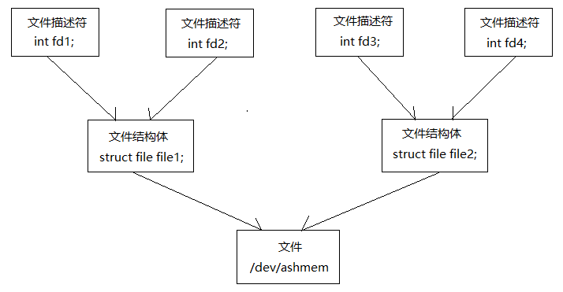

## Ashmem 匿名共享内存系统

Ashmem anonymous share memory

### MemoryFile

| 方法声明                      | 功能描述                 |
| :------------------------ | :------------------- |
| isMemoryFile()            | 验证文件描述符是否指向一块匿名共享内存  |
| isDeactivated()           | 匿名共享内存是否已经映射到进程的地址空间 |
| readBytes()               | 读数据                  |
| writeBytes()              | 写数据                  |
| getParcelFileDescriptor() | 获取文件描述符              |

### ParcelFileDescriptor 

可在进程间传递的文件描述符

- getFileDescriptor()

### FileDescriptor

文件描述符

### 应用实例

IMemoryService.java

```java
public interface IMemoryService extends IInterface {
	public static abstract class Stub extends Binder implements IMemoryService {
		private static final String DESCRIPTOR = "shy.luo.ashmem.IMemoryService";

		public Stub() {
			attachInterface(this, DESCRIPTOR);
		}

		public static IMemoryService asInterface(IBinder obj) {
			if (obj == null) {
				return null;
			}

			IInterface iin = (IInterface)obj.queryLocalInterface(DESCRIPTOR);
			if (iin != null && iin instanceof IMemoryService) {
				return (IMemoryService)iin;
			}

			return new IMemoryService.Stub.Proxy(obj);
		}

		public IBinder asBinder() {
			return this;
		}

		@Override 
		public boolean onTransact(int code, Parcel data, Parcel reply, int flags) throws android.os.RemoteException {
			switch (code) {
			case INTERFACE_TRANSACTION: {
				reply.writeString(DESCRIPTOR);
				return true;
			}
			case TRANSACTION_getFileDescriptor: {
				data.enforceInterface(DESCRIPTOR);
				
				ParcelFileDescriptor result = this.getFileDescriptor();
				
				reply.writeNoException();
				
				if (result != null) {
					reply.writeInt(1);
					result.writeToParcel(reply, 0);
				} else {
					reply.writeInt(0);
				}

				return true;
			}
			case TRANSACTION_setValue: {
				data.enforceInterface(DESCRIPTOR);
				
				int val = data.readInt();
				setValue(val);
				
				reply.writeNoException();
				
				return true;
			}
			}

			return super.onTransact(code, data, reply, flags);
		}

		private static class Proxy implements IMemoryService {
			private IBinder mRemote;

			Proxy(IBinder remote) {
				mRemote = remote;
			}

			public IBinder asBinder() {
				return mRemote;
			}

			public String getInterfaceDescriptor() {
				return DESCRIPTOR;
			}

			public ParcelFileDescriptor getFileDescriptor() throws RemoteException {
				Parcel data = Parcel.obtain();
				Parcel reply = Parcel.obtain();

				ParcelFileDescriptor result;
	
				try {
					data.writeInterfaceToken(DESCRIPTOR);

					mRemote.transact(Stub.TRANSACTION_getFileDescriptor, data, reply, 0);
		
					reply.readException();
					if (0 != reply.readInt()) {
						result = ParcelFileDescriptor.CREATOR.createFromParcel(reply);
					} else {
						result = null;
					}
				} finally {
					reply.recycle();
					data.recycle();
				}
	
				return result;
			}

			public void setValue(int val) throws RemoteException {
				Parcel data = Parcel.obtain();
				Parcel reply = Parcel.obtain();

				try {
					data.writeInterfaceToken(DESCRIPTOR);
					data.writeInt(val);

					mRemote.transact(Stub.TRANSACTION_setValue, data, reply, 0);
					
					reply.readException();
				} finally {
					reply.recycle();
					data.recycle();
				}
			}
		}

		static final int TRANSACTION_getFileDescriptor = IBinder.FIRST_CALL_TRANSACTION + 0;
		static final int TRANSACTION_setValue = IBinder.FIRST_CALL_TRANSACTION + 1;

	}

	public ParcelFileDescriptor getFileDescriptor() throws RemoteException;
	public void setValue(int val) throws RemoteException;
}
```

MemoryService.java

```java
public class MemoryService extends IMemoryService.Stub {
	private final static String LOG_TAG = "shy.luo.ashmem.MemoryService";
	private MemoryFile file = null;
	
	public MemoryService() {
		try {
                        file = new MemoryFile("Ashmem", 4);
                        setValue(0);
                }
                catch(IOException ex) {
                        Log.i(LOG_TAG, "Failed to create memory file.");
                        ex.printStackTrace();
                }
	}

	public ParcelFileDescriptor getFileDescriptor() {
		Log.i(LOG_TAG, "Get File Descriptor.");

		ParcelFileDescriptor pfd = null;

		try {
			pfd = file.getParcelFileDescriptor();
		} catch(IOException ex) {
			Log.i(LOG_TAG, "Failed to get file descriptor.");
			ex.printStackTrace();
		}

		return pfd;
	}
	
	public void setValue(int val) {
		if(file == null) {
			return;
		}

		byte[] buffer = new byte[4];   
		buffer[0] = (byte)((val >>> 24) & 0xFF);
		buffer[1] = (byte)((val >>> 16) & 0xFF);
		buffer[2] = (byte)((val >>> 8) & 0xFF); 
		buffer[3] = (byte)(val & 0xFF);
		
		try {
			file.writeBytes(buffer, 0, 0, 4);
			Log.i(LOG_TAG, "Set value " + val + " to memory file. ");
		}
		catch(IOException ex) {
			Log.i(LOG_TAG, "Failed to write bytes to memory file.");
			ex.printStackTrace();
		}
	}
}
```

Server.java

```java
public class Server extends Service {
    private final static String LOG_TAG = "shy.luo.ashmem.Server";

    private MemoryService memoryService = null;

    @Override
    public IBinder onBind(Intent intent) {
        return null;
    }

    @Override
    public void onCreate() {
	Log.i(LOG_TAG, "Create Memory Service...");

	memoryService = new MemoryService();

        try {
            ServiceManager.addService("AnonymousSharedMemory", memoryService);
            Log.i(LOG_TAG, "Succeed to add memory service.");
        } catch (RuntimeException ex) {
            Log.i(LOG_TAG, "Failed to add Memory Service.");
            ex.printStackTrace();
        }

	//int div = 0;
	//int sum = 10;

	//int ave = sum / div;
    }

    @Override
    public void onStart(Intent intent, int startId) {
        Log.i(LOG_TAG, "Start Memory Service.");
    }

    @Override
    public void onDestroy() {
	Log.i(LOG_TAG, "Destroy Memory Service.");
    }
}
```

Client.java

```java
public class Client extends Activity implements OnClickListener {
	private final static String LOG_TAG = "shy.luo.ashmem.Client";
	
	IMemoryService memoryService = null;
	MemoryFile memoryFile = null;
	
	private EditText valueText = null;
	private Button readButton = null;
	private Button writeButton = null;
	private Button clearButton = null;
	
    	@Override
    	public void onCreate(Bundle savedInstanceState) {
        	super.onCreate(savedInstanceState);
        	setContentView(R.layout.main);

		IMemoryService ms = getMemoryService();
		if(ms == null) {        
			Log.i(LOG_TAG, "start shy.luo.ashmem.server");
        		startService(new Intent("shy.luo.ashmem.server"));
		} else {
			Log.i(LOG_TAG, "Memory Service has started.");
		}

        	valueText = (EditText)findViewById(R.id.edit_value);
        	readButton = (Button)findViewById(R.id.button_read);
        	writeButton = (Button)findViewById(R.id.button_write);
        	clearButton = (Button)findViewById(R.id.button_clear);

		readButton.setOnClickListener(this);
        	writeButton.setOnClickListener(this);
        	clearButton.setOnClickListener(this);
        
        	Log.i(LOG_TAG, "Client Activity Created.");
    	}

    	@Override
    	public void onResume() {
		super.onResume();

		Log.i(LOG_TAG, "Client Activity Resumed.");
    	}

    	@Override
    	public void onPause() {
		super.onPause();

		Log.i(LOG_TAG, "Client Activity Paused.");
    	}
    
    	@Override
    	public void onClick(View v) {
    		if(v.equals(readButton)) {
    			int val = 0;
    		
    			MemoryFile mf = getMemoryFile();
    			if(mf != null) {
				try {
    					byte[] buffer = new byte[4];
    					mf.readBytes(buffer, 0, 0, 4);
    			
    					val = (buffer[0] << 24) | ((buffer[1] & 0xFF) << 16) | ((buffer[2] & 0xFF) << 8) | (buffer[3] & 0xFF);
				} catch(IOException ex) {
					Log.i(LOG_TAG, "Failed to read bytes from memory file.");
					ex.printStackTrace();
				}
    			}	
    		
    			String text = String.valueOf(val);
    			valueText.setText(text);
    		} else if(v.equals(writeButton)) {
    			String text = valueText.getText().toString();
    			int val = Integer.parseInt(text);
    		
    			IMemoryService ms = getMemoryService();
    			if(ms != null) {
				try {
    					ms.setValue(val);
				} catch(RemoteException ex) {
					Log.i(LOG_TAG, "Failed to set value to memory service.");
					ex.printStackTrace();
				}
    			}
    		} else if(v.equals(clearButton)) {
    			String text = "";
    			valueText.setText(text);
    		}
    	}
    
    	private IMemoryService getMemoryService() {
    		if(memoryService != null) {
    			return memoryService;
    		}
    	
    		memoryService = IMemoryService.Stub.asInterface(
                			ServiceManager.getService("AnonymousSharedMemory"));

		Log.i(LOG_TAG, memoryService != null ? "Succeed to get memeory service." : "Failed to get memory service.");
    	
    		return memoryService;
    	}
    
    	private MemoryFile getMemoryFile() {
    		if(memoryFile != null) {
    			return memoryFile;
    		}
    		
    		IMemoryService ms = getMemoryService();
    		if(ms != null) {
			try {
    				ParcelFileDescriptor pfd = ms.getFileDescriptor();
				if(pfd == null) {
					Log.i(LOG_TAG, "Failed to get memory file descriptor.");
					return null;
				}

				try {
					FileDescriptor fd = pfd.getFileDescriptor();
					if(fd == null) {
						Log.i(LOG_TAG, "Failed to get memeory file descriptor.");
						return null;                      
					}	

    					memoryFile = new MemoryFile(fd, 4, "r");
				} catch(IOException ex) {
					Log.i(LOG_TAG, "Failed to create memory file.");
					ex.printStackTrace();
				}
    			} catch(RemoteException ex) {
				Log.i(LOG_TAG, "Failed to get file descriptor from memory service.");
				ex.printStackTrace();
			}
		}
    	
    		return memoryFile;
    	}
}
```

### 匿名共享内存的原理

在Android系统中，每一块匿名共享内存都是使用一个文件描述符来描述的，而这个文件描述符是通过打开设备文件（/dev/ashmem）获得的。当两个进程需要共享一块匿名共享内存时，只需要把它的文件描述符从一个进程传递给另一个进程即可。

在Linux系统中，文件描述符其实就是整数，它只在进程范围内有效，即值相等的两个文件描述符在两个不同的进程中具有不同的含义。在Linux内核中，每一个文件描述符都对应于一个文件结构体（struct file）。文件结构体是内核对象，每一个打开的文件都有一个对应的文件结构体。文件描述符、文件结构体、文件的关系如图所示



不同的文件描述符可以对应同一个文件结构体，而不同的文件结构体也可以对应同一个文件。当应用程序调用函数open来打开一个文件时，文件系统就会为该文件创建一个文件描述符和一个文件结构体，最后将这个文件描述符返回给应用程序。

由于应用程序打开设备文件/dev/ashmem时，Ashmem驱动程序会为它在内核中创建一块匿名共享内存。因此，文件描述符、文件结构体和匿名共享内存的关系如图所示


匿名共享内存能够在两个不同的进程中共享的奥妙在于，这两个进程分别有一个文件描述符fd1和fd2，它们指向了同一个文件结构file1，而这个文件结构体又指向了一块匿名共享内存asma。这时候，如果这两个进程的文件描述符fd1和fd2分别被映射到各自的地址空间，那么它们就会把同一块匿名共享内存映射到各自的地址空间，从而实现在两个不同的进程中共享同一块匿名共享内存。