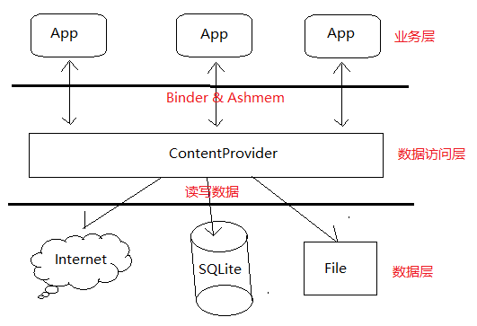
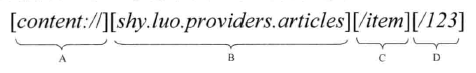
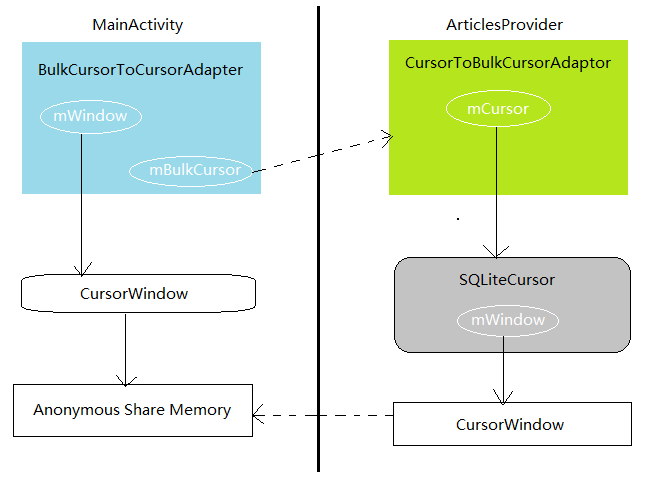

### ContentProvider



每一个ContentProvider组件都是通过一个URI来访问的。每一个URI所访问的资源都具有一种特定的数据类型，这些数据类型使用多功能Internet邮件扩展协议（MIME）来描述。MIME的定义形式为“[type]/[subtype]”，其中，[type]用来描述数据类型的大类，而[subtype]用来描述数据类型的子类。例如，"text/html"描述的数据类型的大类是文本（text），而子类是超文本标记语言（html）



- A组件是一个协议名称，它的值固定为`content://` , 是ContentProvider组件的专用访问协议
- B组件是一个ContentProvider的android:authority属性值
- C组件是一个资源相对路径，用来描述要访问的资源的类型
- D组件是一个资源ID，用来描述要访问的一个具体资源

### 应用实例

自定义ContentProvider

```java
public class ArticlesProvider extends ContentProvider {
	private static final String LOG_TAG = "shy.luo.providers.articles.ArticlesProvider";

	private static final String DB_NAME = "Articles.db";
	private static final String DB_TABLE = "ArticlesTable";
	private static final int DB_VERSION = 1;

	private static final String DB_CREATE = "create table " + DB_TABLE + 
				" (" + Articles.ID + " integer primary key autoincrement, " +
				Articles.TITLE + " text not null, " + 
				Articles.ABSTRACT + " text not null, " +
				Articles.URL + " text not null);";

	private static final UriMatcher uriMatcher;  
	static {  
		uriMatcher = new UriMatcher(UriMatcher.NO_MATCH);  
		uriMatcher.addURI(Articles.AUTHORITY, "item", Articles.ITEM);  
		uriMatcher.addURI(Articles.AUTHORITY, "item/#", Articles.ITEM_ID);  
		uriMatcher.addURI(Articles.AUTHORITY, "pos/#", Articles.ITEM_POS);
	}  

	private static final HashMap<String, String> articleProjectionMap;
    	static {
        	articleProjectionMap = new HashMap<String, String>();
        	articleProjectionMap.put(Articles.ID, Articles.ID);
        	articleProjectionMap.put(Articles.TITLE, Articles.TITLE);
        	articleProjectionMap.put(Articles.ABSTRACT, Articles.ABSTRACT);
        	articleProjectionMap.put(Articles.URL, Articles.URL);
    	}


	private DBHelper dbHelper = null;
	private ContentResolver resolver = null;
	
	@Override  
	public boolean onCreate() {  
		Context context = getContext();
		resolver = context.getContentResolver();
		dbHelper = new DBHelper(context, DB_NAME, null, DB_VERSION);

		Log.i(LOG_TAG, "Articles Provider Create");
  
		return true;  
	}	 

	@Override  
	public String getType(Uri uri) {  
		switch (uriMatcher.match(uri)) {  
		case Articles.ITEM:  
			return Articles.CONTENT_TYPE;  
		case Articles.ITEM_ID:  
		case Articles.ITEM_POS:
			return Articles.CONTENT_ITEM_TYPE;  
		default:  
			throw new IllegalArgumentException("Error Uri: " + uri);  
		}
	}

	@Override  
	public Uri insert(Uri uri, ContentValues values) {
		if(uriMatcher.match(uri) != Articles.ITEM) {  
			throw new IllegalArgumentException("Error Uri: " + uri);  
		}  

		SQLiteDatabase db = dbHelper.getWritableDatabase();
                
        long id = db.insert(DB_TABLE, Articles.ID, values);
		if(id < 0) {
			throw new SQLiteException("Unable to insert " + values + " for " + uri);
		}

		Uri newUri = ContentUris.withAppendedId(uri, id);
		resolver.notifyChange(newUri, null);

		return newUri;
	}

	@Override  
	public int update(Uri uri, ContentValues values, String selection, String[] selectionArgs) {    
		SQLiteDatabase db = dbHelper.getWritableDatabase();
        int count = 0;

		switch(uriMatcher.match(uri)) {
		case Articles.ITEM: {
			count = db.update(DB_TABLE, values, selection, selectionArgs);
			break;
		}
		case Articles.ITEM_ID: {
			String id = uri.getPathSegments().get(1);
            count = db.update(DB_TABLE, values, Articles.ID + "=" + id
                    			+ (!TextUtils.isEmpty(selection) ? " and (" + selection + ')' : ""), selectionArgs);
			break;
		}
		default:
			throw new IllegalArgumentException("Error Uri: " + uri);
		}

		resolver.notifyChange(uri, null);

		return count;
	}

	@Override  
	public int delete(Uri uri, String selection, String[] selectionArgs) { 
		SQLiteDatabase db = dbHelper.getWritableDatabase();
                int count = 0;

                switch(uriMatcher.match(uri)) {
                case Articles.ITEM: {
                        count = db.delete(DB_TABLE, selection, selectionArgs);
                        break;
                }
                case Articles.ITEM_ID: {
                        String id = uri.getPathSegments().get(1);
                        count = db.delete(DB_TABLE, Articles.ID + "=" + id
                                        + (!TextUtils.isEmpty(selection) ? " and (" + selection + ')' : ""), selectionArgs);
                        break;
                }
                default:
                        throw new IllegalArgumentException("Error Uri: " + uri);
                }

                resolver.notifyChange(uri, null);

                return count;
	}

	@Override  
	public Cursor query(Uri uri, String[] projection, String selection, String[] selectionArgs, String sortOrder) {
		Log.i(LOG_TAG, "ArticlesProvider.query: " + uri);

		SQLiteDatabase db = dbHelper.getReadableDatabase();

		SQLiteQueryBuilder sqlBuilder = new SQLiteQueryBuilder(); 
		String limit = null;           	

		switch (uriMatcher.match(uri)) {
            	case Articles.ITEM: {
                	sqlBuilder.setTables(DB_TABLE);
                	sqlBuilder.setProjectionMap(articleProjectionMap);
                	break;
		}
            	case Articles.ITEM_ID: {
			String id = uri.getPathSegments().get(1);
                	sqlBuilder.setTables(DB_TABLE);
                	sqlBuilder.setProjectionMap(articleProjectionMap);
                	sqlBuilder.appendWhere(Articles.ID + "=" + id);
                	break;
		}
		case Articles.ITEM_POS: {
			String pos = uri.getPathSegments().get(1);
			sqlBuilder.setTables(DB_TABLE);
            sqlBuilder.setProjectionMap(articleProjectionMap);
			limit = pos + ", 1";
			break;
		}
      default:
      	throw new IllegalArgumentException("Error Uri: " + uri);
      }

		Cursor cursor = sqlBuilder.query(db, projection, selection, selectionArgs, null, null, TextUtils.isEmpty(sortOrder) ? Articles.DEFAULT_SORT_ORDER : sortOrder, limit);
		cursor.setNotificationUri(resolver, uri);

		return cursor;
	}

	@Override
	public Bundle call(String method, String request, Bundle args) {
		Log.i(LOG_TAG, "ArticlesProvider.call: " + method);

		if(method.equals(Articles.METHOD_GET_ITEM_COUNT)) {
			return getItemCount();	
		}	

		throw new IllegalArgumentException("Error method call: " + method);
	}

	private Bundle getItemCount() {
		Log.i(LOG_TAG, "ArticlesProvider.getItemCount");

        SQLiteDatabase db = dbHelper.getReadableDatabase();
		Cursor cursor = db.rawQuery("select count(*) from " + DB_TABLE, null);
		
		int count = 0;
		if (cursor.moveToFirst()) {
        	count = cursor.getInt(0);
        }

		Bundle bundle = new Bundle();
		bundle.putInt(Articles.KEY_ITEM_COUNT, count);
	
		cursor.close();	
		db.close();

        return bundle;
	}
	
	private	static class DBHelper extends SQLiteOpenHelper {
		public DBHelper(Context context, String name, CursorFactory factory, int version) {
			super(context, name, factory, version);
		}
		
		@Override
		public void onCreate(SQLiteDatabase db) {
			db.execSQL(DB_CREATE);
		}
		
		@Override
		public void onUpgrade(SQLiteDatabase db, int oldVersion, int newVersion) {
			db.execSQL("DROP TABLE IF EXISTS " + DB_TABLE);
			onCreate(db);
		}
	}
}
```

Articles

```java
public class Articles {
	/*Data Field*/
	public static final String ID = "_id";
        public static final String TITLE = "_title";
        public static final String ABSTRACT = "_abstract";
        public static final String URL = "_url";

	/*Default sort order*/
	public static final String DEFAULT_SORT_ORDER = "_id asc";

	/*Call Method*/
	public static final String METHOD_GET_ITEM_COUNT = "METHOD_GET_ITEM_COUNT";
	public static final String KEY_ITEM_COUNT = "KEY_ITEM_COUNT";

	/*Authority*/
	public static final String AUTHORITY = "shy.luo.providers.articles";
	
	/*Match Code*/
	public static final int ITEM = 1;
	public static final int ITEM_ID = 2;
	public static final int ITEM_POS = 3;
	
	/*MIME*/
	public static final String CONTENT_TYPE = "vnd.android.cursor.dir/vnd.shy.luo.article";  
	public static final String CONTENT_ITEM_TYPE = "vnd.android.cursor.item/vnd.shy.luo.article";  

	/*Content URI*/
	public static final Uri CONTENT_URI = Uri.parse("content://" + AUTHORITY + "/item"); 
	public static final Uri CONTENT_POS_URI = Uri.parse("content://" + AUTHORITY + "/pos");
}
```

ArticlesAdapter

```java
public class ArticlesAdapter {
	private static final String LOG_TAG = "shy.luo.article.ArticlesAdapter";

	private ContentResolver resolver = null;
	
	public ArticlesAdapter(Context context) {
		resolver = context.getContentResolver();
	}
	
	public long insertArticle(Article article) {	
		ContentValues values = new ContentValues();
		values.put(Articles.TITLE, article.getTitle());
		values.put(Articles.ABSTRACT, article.getAbstract());
		values.put(Articles.URL, article.getUrl());
		
		Uri uri = resolver.insert(Articles.CONTENT_URI, values);
		String itemId = uri.getPathSegments().get(1);
		
		return Integer.valueOf(itemId).longValue();
	}
	
	public boolean updateArticle(Article article) {
		Uri uri = ContentUris.withAppendedId(Articles.CONTENT_URI, article.getId());
		
		ContentValues values = new ContentValues();
		values.put(Articles.TITLE, article.getTitle());
		values.put(Articles.ABSTRACT, article.getAbstract());
		values.put(Articles.URL, article.getUrl());
		
		int count = resolver.update(uri, values, null, null);
		
		return count > 0;
	}
	
	public boolean removeArticle(int id) {
    	Uri uri = ContentUris.withAppendedId(Articles.CONTENT_URI, id);
     	int count = resolver.delete(uri, null, null);
    	return count > 0;
	}
	
	public LinkedList<Article> getAllArticles() {
		LinkedList<Article> articles = new LinkedList<Article>();
		
        	String[] projection = new String[] { 
        		    Articles.ID,       
                	Articles.TITLE,
                	Articles.ABSTRACT,
                	Articles.URL
        	};
    
        	Cursor cursor = resolver.query(Articles.CONTENT_URI, projection, null, null, Articles.DEFAULT_SORT_ORDER);
		if (cursor.moveToFirst()) {
			do {
				int id = cursor.getInt(0);
				String title = cursor.getString(1);
				String abs = cursor.getString(2);
				String url = cursor.getString(3);
				
				Article article = new Article(id, title, abs, url);
				articles.add(article);
			} while(cursor.moveToNext());
		}
		
		return articles;
	}
	
	public int getArticleCount() {
                Log.i(LOG_TAG, "ArticlesAdapter.getArticleCount");

		/*
        	Cursor cursor = resolver.query(Articles.CONTENT_COUNT_URI, null, null, null, Articles.DEFAULT_SORT_ORDER);
        
		Log.i(LOG_TAG, "cursor.moveToFirst");

        	if (!cursor.moveToFirst()) {
			return 0;
		}
		
		return cursor.getInt(0);
		*/
		
		int count = 0;

		try {
			IContentProvider provider = resolver.acquireProvider(Articles.CONTENT_URI);
			Bundle bundle = provider.call(Articles.METHOD_GET_ITEM_COUNT, null, null);
			count = bundle.getInt(Articles.KEY_ITEM_COUNT, 0);
		} catch(RemoteException e) {
			e.printStackTrace();		
		}

		return count;
	}
	
	public Article getArticleById(int id) {
		Uri uri = ContentUris.withAppendedId(Articles.CONTENT_URI, id);
		
		String[] projection = new String[] { 
				Articles.ID,       
	            Articles.TITLE,
	            Articles.ABSTRACT,
	            Articles.URL
	    	};
	    
		Cursor cursor = resolver.query(uri, projection, null, null, Articles.DEFAULT_SORT_ORDER);
		
		Log.i(LOG_TAG, "cursor.moveToFirst");

		if (!cursor.moveToFirst()) {
			return null;
		}
		
		String title = cursor.getString(1);
		String abs = cursor.getString(2);
		String url = cursor.getString(3);

		return new Article(id, title, abs, url);
	}
	
	public Article getArticleByPos(int pos) {
		Uri uri = ContentUris.withAppendedId(Articles.CONTENT_POS_URI, pos);

		String[] projection = new String[] { 
				Articles.ID,       
	            Articles.TITLE,
	            Articles.ABSTRACT,
	            Articles.URL
	    	};
	    
		Cursor cursor = resolver.query(uri, projection, null, null, Articles.DEFAULT_SORT_ORDER);
		if (!cursor.moveToFirst()) {
			return null;
		}
		
		int id = cursor.getInt(0);
		String title = cursor.getString(1);
		String abs = cursor.getString(2);
		String url = cursor.getString(3);

		return new Article(id, title, abs, url);
	}
}
```

MainActivity

```java
public class MainActivity extends Activity implements View.OnClickListener, AdapterView.OnItemClickListener {
	private final static String LOG_TAG = "shy.luo.article.MainActivity";
	
	private final static int ADD_ARTICAL_ACTIVITY = 1;
	private final static int EDIT_ARTICAL_ACTIVITY = 2;
	
	private ArticlesAdapter aa = null;
 	private ArticleAdapter adapter = null;
	private ArticleObserver observer = null;
	
	private ListView articleList = null;
	private Button addButton = null;
	
	@Override
	public void onCreate(Bundle savedInstanceState) { 
		super.onCreate(savedInstanceState);
		setContentView(R.layout.main);
		 
		aa = new ArticlesAdapter(this);
		
		articleList = (ListView)findViewById(R.id.listview_article);
		adapter = new ArticleAdapter(this);
		articleList.setAdapter(adapter);
		articleList.setOnItemClickListener(this);

		observer = new ArticleObserver(new Handler());
		getContentResolver().registerContentObserver(Articles.CONTENT_URI, true, observer);
		
		addButton = (Button)findViewById(R.id.button_add);
		addButton.setOnClickListener(this);

	    	Log.i(LOG_TAG, "MainActivity Created");
	}

	@Override
	public void onDestroy() {
		super.onDestroy();

		getContentResolver().unregisterContentObserver(observer);
	} 
	
	@Override
	public void onClick(View v) {
		if(v.equals(addButton)) {
			Uri uri = Articles.CONTENT_URI;
			int count = uri.getPathSegments().size();
			Log.i(LOG_TAG, "count: " + count);
			for(int i = 0; i < count; ++i) {
				String segment = uri.getPathSegments().get(i);
				Log.i(LOG_TAG, "segment " + i + ": " + segment);	
			}
			
			Intent intent = new Intent(this, ArticleActivity.class);
	    		startActivityForResult(intent, ADD_ARTICAL_ACTIVITY);
		}
	}
	
	@Override
	public void onItemClick(AdapterView<?> parent, View view, int pos, long id) {
		Intent intent = new Intent(this, ArticleActivity.class);
		
		Article article = aa.getArticleByPos(pos);
		intent.putExtra(Articles.ID, article.getId());
		intent.putExtra(Articles.TITLE, article.getTitle());
		intent.putExtra(Articles.ABSTRACT, article.getAbstract());
		intent.putExtra(Articles.URL, article.getUrl());
		
    	startActivityForResult(intent, EDIT_ARTICAL_ACTIVITY);
	}
	
	
	@Override
	public void onActivityResult(int requestCode,int resultCode, Intent data) {
		super.onActivityResult(requestCode, resultCode, data);
	    
		switch(requestCode) {
		case ADD_ARTICAL_ACTIVITY: {
			if(resultCode == Activity.RESULT_OK) {
				String title = data.getStringExtra(Articles.TITLE);
				String abs = data.getStringExtra(Articles.ABSTRACT);
				String url = data.getStringExtra(Articles.URL);
				
				Article article = new Article(-1, title, abs, url);
				aa.insertArticle(article);
				
				//adapter.notifyDataSetChanged();
			}
			
			break;
		}
		case EDIT_ARTICAL_ACTIVITY: {
			if(resultCode == Activity.RESULT_OK) {
				int action = data.getIntExtra(ArticleActivity.EDIT_ARTICLE_ACTION, -1);
				if(action == ArticleActivity.MODIFY_ARTICLE) {
					int id = data.getIntExtra(Articles.ID, -1);
					String title = data.getStringExtra(Articles.TITLE);
					String abs = data.getStringExtra(Articles.ABSTRACT);
					String url = data.getStringExtra(Articles.URL);
					
					Article article = new Article(id, title, abs, url);
					aa.updateArticle(article);
				} else if(action == ArticleActivity.DELETE_ARTICLE)	{
					int id = data.getIntExtra(Articles.ID, -1);
					
					aa.removeArticle(id);
				}
				
				//adapter.notifyDataSetChanged();
			}
			
			break;
		}
		}
	}

	private class ArticleObserver extends ContentObserver {
		public ArticleObserver(Handler handler) {
			super(handler);
		}

		@Override
		public void onChange (boolean selfChange) {
			Log.i("MainActivity.ArticleObserver", "MainActivity.ArticleObserver.onChange(" + selfChange  + ")");

			adapter.notifyDataSetChanged();
		}
	}
	     
	private class ArticleAdapter extends BaseAdapter {
		private LayoutInflater inflater;

		public ArticleAdapter(Context context){
			  inflater = LayoutInflater.from(context);
		}
		
		@Override
		public int getCount() {
			return aa.getArticleCount();
		}
		
		@Override
		public Object getItem(int pos) {
			return aa.getArticleByPos(pos);
		}

		@Override
		public long getItemId(int pos) {
			return aa.getArticleByPos(pos).getId();
		}

		@Override
		public View getView(int position, View convertView, ViewGroup parent) {			
		
			Article article = (Article)getItem(position);
			
			if (convertView == null) {
				convertView = inflater.inflate(R.layout.item, null);
			}
			
			TextView titleView = (TextView)convertView.findViewById(R.id.textview_article_title);
			titleView.setText("Title: " + article.getTitle());
			
			TextView abstractView = (TextView)convertView.findViewById(R.id.textview_article_abstract);
			abstractView.setText("Abstract: " + article.getAbstract());
			
			TextView urlView = (TextView)convertView.findViewById(R.id.textview_article_url);
			urlView.setText("URL: " + article.getUrl());
			
			return convertView;
		}
	}
}
```

ArticleActivity

```java
public class ArticleActivity extends Activity implements View.OnClickListener {
	private final static String LOG_TAG = "shy.luo.article.ArticleActivity";
	
	public final static String EDIT_ARTICLE_ACTION = "EDIT_ARTICLE_ACTION";
	public final static int MODIFY_ARTICLE = 1;
	public final static int DELETE_ARTICLE = 2;
	
	private int articleId = -1;
	
	private EditText titleEdit = null;
	private EditText abstractEdit = null;
	private EditText urlEdit = null;
	
	private Button addButton = null;
	private Button modifyButton = null;
	private Button deleteButton = null;
	private Button cancelButton = null;
	
	@Override
	public void onCreate(Bundle savedInstanceState) { 
		super.onCreate(savedInstanceState);
		setContentView(R.layout.article);
		
		titleEdit = (EditText)findViewById(R.id.edit_article_title);
		abstractEdit = (EditText)findViewById(R.id.edit_article_abstract);
		urlEdit = (EditText)findViewById(R.id.edit_article_url);
		
		addButton = (Button)findViewById(R.id.button_add_article);
		addButton.setOnClickListener(this);
		
		modifyButton = (Button)findViewById(R.id.button_modify);
		modifyButton.setOnClickListener(this);
		
		deleteButton = (Button)findViewById(R.id.button_delete);
		deleteButton.setOnClickListener(this);
		
		cancelButton = (Button)findViewById(R.id.button_cancel);
		cancelButton.setOnClickListener(this);
		
		Intent intent = getIntent();
		articleId = intent.getIntExtra(Articles.ID, -1);
		
		if(articleId != -1) {
			String title = intent.getStringExtra(Articles.TITLE);
			titleEdit.setText(title);
			
			String abs = intent.getStringExtra(Articles.ABSTRACT);
			abstractEdit.setText(abs);
			
			String url = intent.getStringExtra(Articles.URL);
			urlEdit.setText(url);
			
			addButton.setVisibility(View.GONE);
		} else {
			modifyButton.setVisibility(View.GONE);
			deleteButton.setVisibility(View.GONE);
		}
		
		Log.i(LOG_TAG, "ArticleActivity Created");
	}
	
	@Override
	public void onClick(View v) {
		if(v.equals(addButton)) {
			String title = titleEdit.getText().toString();
			String abs = abstractEdit.getText().toString();
			String url = urlEdit.getText().toString();
			
			Intent result = new Intent();
			result.putExtra(Articles.TITLE, title);
			result.putExtra(Articles.ABSTRACT, abs);
			result.putExtra(Articles.URL, url);
			
			setResult(Activity.RESULT_OK, result);
			finish();
		} else if(v.equals(modifyButton)){
			String title = titleEdit.getText().toString();
			String abs = abstractEdit.getText().toString();
			String url = urlEdit.getText().toString();
			
			Intent result = new Intent();
			result.putExtra(Articles.ID, articleId);
			result.putExtra(Articles.TITLE, title);
			result.putExtra(Articles.ABSTRACT, abs);
			result.putExtra(Articles.URL, url);
			result.putExtra(EDIT_ARTICLE_ACTION, MODIFY_ARTICLE);
			
			setResult(Activity.RESULT_OK, result);
			finish();
		} else if(v.equals(deleteButton)) {
			Intent result = new Intent();
			result.putExtra(Articles.ID, articleId);
			result.putExtra(EDIT_ARTICLE_ACTION, DELETE_ARTICLE);
			
			setResult(Activity.RESULT_OK, result);
			finish();
		} else if(v.equals(cancelButton)) {
			setResult(Activity.RESULT_CANCELED, null);
			finish();
		}
	}
}
```

Article实体

```java
public class Article {
	public int id;
	public String title;
	public String abs;
	public String url;
}
```
### 数据共享原理



### 数据更新通知机制

消息发布和订阅的事件驱动模型，内容观察者（ContentObserver）负责接收数据更新通知，而ContentProvider组件负责发送数据更新通知。

内容观察者在接收数据更新通知之前，必须要先注册到ContentService中，并且告诉ContentService它要接收什么样的数据更新通知。这是通过一个URI来描述的。当ContentProvider组件中的数据发生更新时，ContentProvider组件就会将用来描述这个数据的URI发送给ContentService，以便ContentService可以找到与这个URI对应的内容观察者，最后向它们发送一个数据更新通知。