# Android系统的跨进程简介

## 为什么不能直接跨进程通信？

为了安全考虑，应用之间的内存是无法互相访问的，各自的数据都存在于自身的内存区域内。

## 如何跨进程通信？

要想跨进程通信，就要找到一个大家都能访问的地方，例如硬盘上的文件，多个进程都可以读写该文件，通过对该文件进行读写约定好的数据，来达到通信的目的。

Android中的跨进程通信采用的是Binder机制，其底层原理是共享内存。

# Binder机制

- Android中的跨进程通信采用的是Binder机制。
- Binder在linux层面属于一个驱动，但是这个驱动不是去驱动一个硬件，而且驱动一小段内存。
- 不同的应用通过对一块内存区域进行数据的读、写操作来达到通信的目的。
- 不同的应用在同一内存区域读写数据，为了告知其他应用如何理解写入的数据，就需要一个说明文件，这就是AIDL。当两个应用持有相同的AIDL文件，就能互相理解对方的的意图，就能做出相应的回应，达到通信的目的。

# 系统服务

## 什么是系统服务？
由android系统提供的服务，以供应用程序调用，来操作手机。如果应用能直接操作手机，后果将不堪设想，为了安全性和统一性，所有手机操作都将由系统来完成，应用通过发送消息给系统服务来请求操作。系统服务就是系统开放给应用端的操作接口，类似于Web服务开放出来的接口。

我们通过context. getSystemService()可以获取到系统服务的代理对象，该代理对象内部有一个系统服务的远程对象引用。代理对象和系统服务有相同的api接口，我们调用代理对象，代理对象会调用远程对象，远程对象通知系统服务，这样操作起来就像直接访问系统服务一样轻松。

# 系统服务和应用端的通信机制

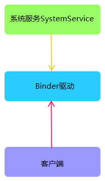

- 系统服务XxxService

  是一个Binder类的子类，一旦创建后，就开启一个线程死循环用来检测某段内存是否有数据写入

- Binder驱动

  自身创建时，创建一个XxxRemote远程对象，存放到Binder驱动中，XxxRemote远程对象可以和XxxService系统服务通信

- 应用端

  通过context. getSystemService()获取XxxServiceProxy对象，该对象内部引用了XxxRemote对象， XxxServiceProxy和XxxService具有相同的API，我们调用XxxServiceProxy时，XxxServiceProxy就调用XxxRemote并等待XxxRemote返回。XxxRemote会往某段内存中写入数据，写完后就开始监视该内存区域，Binder驱动会把XxxRemote写入的数据拷贝到XxxService监视着的内存区域，当XxxService一旦发现有数据，就读取并进行处理，处理完毕后，就写入该区域，这时Binder驱动又会把该数据拷贝到XxxRemote监视的内存区域，当XxxService发现内存区域有数据读取该区域数据，并把内容返回给XxxServiceProxy。这样就完成了一次进程间的通信。

所以一个系统服务会产生两个Binder对象，一个是运行在系统中的系统服务本身，一个是存放到Binder驱动中的远程对象。所不同的是系统服务Binder对象对开启一个线程监听消息，远程对象不会，它是运行在调用者的线程中。

客户端也可以不使用系统服务的远程Binder对象，而是自己创建一个Binder对象，通过Binder驱动和系统服务进行关联，这样的好处客户端可以随时通知系统服务，系统服务也可以随时通知客户端，而不是像上面所说的系统服务只能被动的等着客户端调用。

# Binder间的通信机制

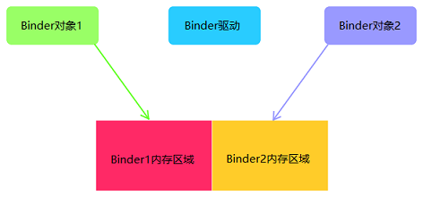

Binder对象都有各自的内存区域，当Binder1想要向Binder2发送数据时，就会把数据写入自己的内存区域，然后通知Binder驱动，Binder驱动会把数据拷贝到Binder2的内存区域，然后通知Binder2进行读取，Binder读取完毕后，将把数据写入binder2的内存区域，然后通知Binder驱动，Binder驱动将会把数据拷贝到Binder1的内存区域中。这样就完成了一次通信。

如果Binder1是系统服务，Binder2是系统服务的远程对象，这样任何应用程序在获取了Binder2的引用后，都可以和Binder1进行通信。但是缺点也很明显，只能由应用端请求系统服务，系统服务不能主动去联系应用端。WifiManagerService之类的就是采用这种方式。

还有一种方式是Binder1是系统服务，Binder2是应用端创建的Binder对象，他们两者通过Binder驱动进行连接后，应用端可以主动调系统服务，系统服务也可以主动调用应用端。WindowManagerService就是采用的这种方式。

## IPC

IPC：进程间通信或跨进程通信，是指两个进程间进行数据交换的过程。

PRC：远程过程调用

## 多进程

线程是CPU调度的最小单元，是程序执行的线索，同时线程是一种有限的系统资源，即线程不可能无限制地产生，并且线程的创建和销毁都有相应的开销。而进程一般指一个执行单元，在PC和移动设备上指一个程序或者一个应用。一个进程可以包含多个线程，因此进程和线程是包含与被包含的关系。

- Intent
- Bundle
- 共享文件
- 匿名共享内存 Ashmem(anonymous share memory)
- SharedPrefrence
- ContentProvider
- Messenger
- AIDL
- Binder 粘结剂 胶水，安全，高性能，采用Client-Server通信方式
- 插口Socket
- 管道Pipe
- 命令管道Named Pipe
- 信号Signal
- 跟踪Trace
- System V IPC
  - 报文队列Message
  - 共享内存Share Memory
  - 信号量Semaphore

IPC方式的优缺点和使用场景

| 名称              | 优点                                       | 缺点                                       | 使用场景                                |
| :-------------- | :--------------------------------------- | :--------------------------------------- | :---------------------------------- |
| Bundle          | 简单易用                                     | 只能传输Bundle支持的数据类型                        | 四大组件间的进程间通信                         |
| 文件共享            | 简单易用                                     | 不适合高并发场景，并且无法做到进程间的即时通信                  | 无并发访问情形，交换简单的数据实时性不高的场景             |
| AIDL            | 功能强大，支持一对多并发通信，支持实时通信                    | 使用稍复杂，需要处理线程同步                           | 一对多通信且有PRC需求                        |
| Messenger       | 功能一般，支持一对多串行通信，支持实时通信                    | 不能很好处理高并发情形，不支持PRC，数据通过Message进行传输，因此只能传输Bundle支持的数据类型 | 低并发的一对多即时通信需求，无PRC需求，或者无须返回结果的PRC需求 |
| ContentProvider | 在数据源访问方面功能强大，支持一对多并发数据共享，可通过Call方法扩展其他操作 | 可以理解为受约束的AIDL，主要提供数据源的CRUD操作             | 一对多的进程间数据共享                         |
| Socket          | 功能强大，可以通过网络传输字节流，支持一对多并发实时通信             | 实现细节稍微有点烦琐，不支持直接的PRC                     | 网络交换数据                              |

### Android中的多进程模式

- 一个应用中存在多个进程的情况
- 多个应用间的多进程

```
android:process=":remote" 私有进程
android:process="com.google.googleplay.remote" 全局进程
```

## 序列化

序列化，反序列化，持久化

### Serializable

Java提供的一个序列化接口

序列化流

- ObjectInputStream
- ObjectOutputStream

### Parcelable

Android提供的序列化接口

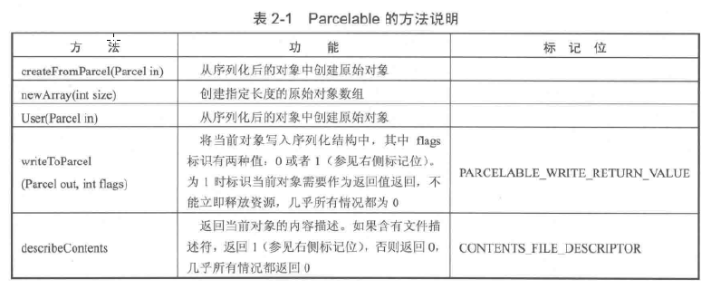

Serializable是Java中的序列化接口，其使用起来简单但是开销很大，序列化和反序列化过程需要大量I/O操作。而Parcelable是Android中的序列化方式，因此，更适合用在Android平台上，它的缺点就是用起来稍微麻烦点，但是它的效率很高，这是Android推荐的序列化方式，因此，我们要首选Parcelable。Parcelable主要用在内存序列化上，通过Parcelable将对象序列化到存储设备中或者将对象序列化后通过网络传输也都是可以的，但是这个过程会稍显复杂，因此在这两种情况下建议大家使用Parcelable。

## Binder

实现IBinder接口，是Android的一种跨进程通信方式，是客户端和服务端进行通信的媒介。

Android Binder框架分为服务器接口、Binder驱动、以及客户端接口；简单想一下，需要提供一个全局服务，那么全局服务那端即是服务器接口，任何程序即客户端接口，它们之间通过一个Binder驱动访问。

服务器端接口：实际上是Binder类的对象，该对象一旦创建，内部则会启动一个隐藏线程，会接收Binder驱动发送的消息，收到消息后，会执行Binder对象中的onTransact()函数，并按照该函数的参数执行不同的服务器端代码。

Binder驱动：该对象也为Binder类的实例，客户端通过该对象访问远程服务。

客户端接口：获得Binder驱动，调用其transact()发送消息至服务器

```java
public class Binder implements IBinder {
}
```

- IBinder
- Binder
- Stub
- Binder线程池

当客户端发起远程请求时，由于当前线程会被挂起直至服务端进程返回数据，所有一个远程方法是很耗时的，那么不能在UI线程中发起此远程请求；由于服务端的Binder运行在Binder的线程池中，所以Binder方法不管是否耗时都采用同步的方式去实现，因为它已经运行在一个线程中了

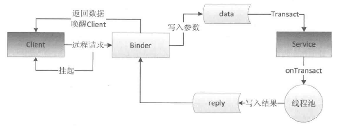

Binder死亡代理

- IBinder.DeathRecipient
- linkToDeath()
- unlinkToDeath()
- isBinderAlive()

### 共享文件

一个进程序列化对象到sd上的一个文件，另一个进程反序列化sd上的一文件

### Messenger

底层实现是AIDL，一次处理一个请求，串行处理消息，不用考虑线程同步的问题，主要作用是传递消息

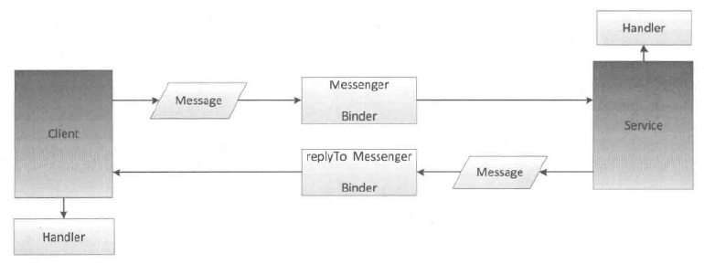

### AIDL

Android系统提供了一种描述语言来定义具有跨进程访问能力的服务接口，这种描述语言称为Android接口描述语言（Android Interface Definition Language，AIDL）。

- 只支持方法，不支持静态常量
- AIDL的包结构在服务端和客户端要保持一致
- AIDL中无法使用普通接口，只能使用AIDL接口
- 对象是不能跨进程直接传输的，对象的跨进程传输本质上都是反序列化的过程，这就是为什么AIDL中的自定义对象都必须要实现Parcelable接口的原因


首先创建一个Service和一个AIDL接口，接着创建一个类继承自AIDL接口中的Stub类并实现Stub类中的抽象方法，在Service的onBind()方法返回这个类的对象，然后客户端就可以帮到服务端Service，建立连接后就可以访问远程服务端的方法了。

客户端调用远程服务的方法，被调用的方法允运行在服务端的Binder线程池中，同时客户端线程会被挂起，这个时候如果服务端方法执行比较耗时，就会导致客户端线程长时间的阻塞在哪里，而如果这个客户端线程是UI线程的话，就会导致客户端ANR，这当然不是我们想要看到的。因此，如果我们明确知道某个远程方法是耗时的，那么，我们就应该避免在客户端的UI线程去访问远程方法。由于客户端的onServiceConnected()和onServiceDisconnected()方法都运行在UI线程中，所以也不可以在它们里面直接调用服务端的耗时方法，这点要尤其注意。另外，由于服务端的方法本身就运行在服务端的Binder线程池中，所以服务端方法本身可以执行大量耗时操作，这个时候切记不要在服务端方法中开线程去进行异步任务，除非你明确知道自己在干什么，否则不建议这么做。

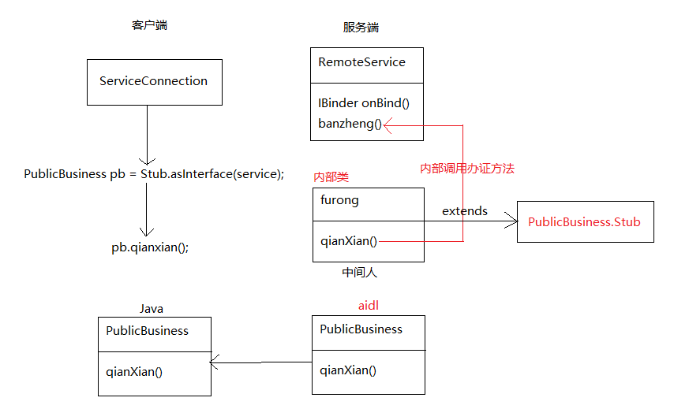

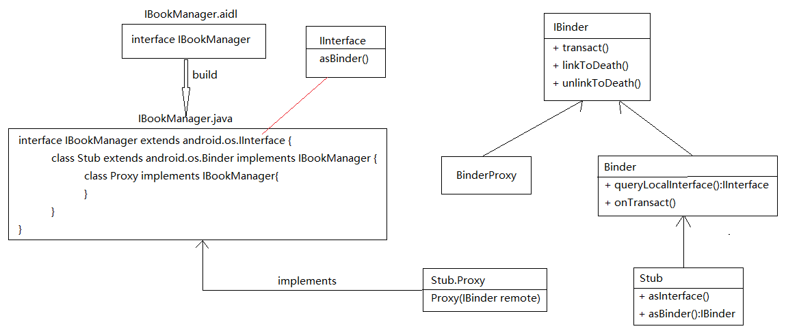

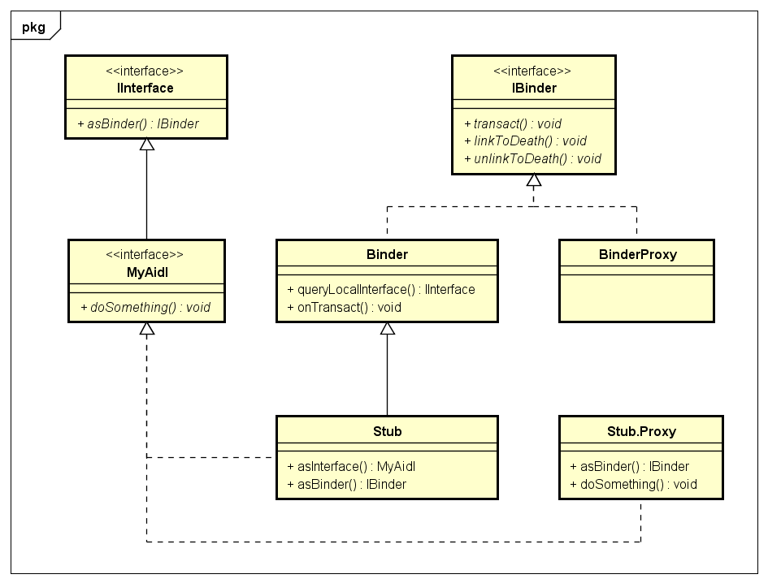

### RemoteCallbackList

```java
public class RemoteCallbackList<E extends IInterface>{
}
```

- 系统专门提供的用于删除跨进程listener的接口
- 客户端终止后会自动删除客户端注册的listener
- 实现了线程同步功能


### 权限验证

- onBind()方法中验证

  - permission验证，checkCallingOrSelfPermission()
- onTransact()中验证
- Uid和Pid验证
  - getCallingPid()
  - getCallingUid()
- 为Service指定android:permission属性

### ContentProvider

### Binder连接池

### Binder

- 公共接口aidl --> java接口
- onTransact()。该函数分析收到的数据包，调用相应的接口函数处理请求。
- Binder对象是可以进行跨进程传递的对象
- Binder本地对象
- Binder代理对象
- IBinder:代表了**一种跨进程传输的能力**,Binder驱动完成不同进程**Binder本地对象**以及**Binder代理对象**的转换
- IInterface代表的就是远程server对象具有什么能力。具体来说，就是aidl里面的接口。

## 客户端和服务端在同一进程

扩展 Binder 类

### 服务端

```java
public class LocalService extends Service {
    // Binder given to clients
    private final IBinder mBinder = new LocalBinder();
    // Random number generator
    private final Random mGenerator = new Random();

    /
     * Class used for the client Binder.  Because we know this service always
     * runs in the same process as its clients, we don't need to deal with IPC.
     */
    public class LocalBinder extends Binder {
        LocalService getService() {
            // Return this instance of LocalService so clients can call public methods
            return LocalService.this;
        }
    }

    @Override
    public IBinder onBind(Intent intent) {
        return mBinder;
    }

    / method for clients */
    public int getRandomNumber() {
      return mGenerator.nextInt(100);
    }
}
```

### 客户端

```java
public class BindingActivity extends Activity {
    LocalService mService;
    boolean mBound = false;

    @Override
    protected void onCreate(Bundle savedInstanceState) {
        super.onCreate(savedInstanceState);
        setContentView(R.layout.main);
    }

    @Override
    protected void onStart() {
        super.onStart();
        // Bind to LocalService
        Intent intent = new Intent(this, LocalService.class);
        bindService(intent, mConnection, Context.BIND_AUTO_CREATE);
    }

    @Override
    protected void onStop() {
        super.onStop();
        // Unbind from the service
        if (mBound) {
            unbindService(mConnection);
            mBound = false;
        }
    }

    / Called when a button is clicked (the button in the layout file attaches to
      * this method with the android:onClick attribute) */
    public void onButtonClick(View v) {
        if (mBound) {
            // Call a method from the LocalService.
            // However, if this call were something that might hang, then this request should
            // occur in a separate thread to avoid slowing down the activity performance.
            int num = mService.getRandomNumber();
            Toast.makeText(this, "number: " + num, Toast.LENGTH_SHORT).show();
        }
    }

    / Defines callbacks for service binding, passed to bindService() */
    private ServiceConnection mConnection = new ServiceConnection() {

        @Override
        public void onServiceConnected(ComponentName className,
                IBinder service) {
            // We've bound to LocalService, cast the IBinder and get LocalService instance
            LocalBinder binder = (LocalBinder) service;
            mService = binder.getService();
            mBound = true;
        }

        @Override
        public void onServiceDisconnected(ComponentName arg0) {
            mBound = false;
        }
    };
}
```
## RemoteViews

应用：通知栏和桌面小部件

### NotificationManager

### APPWidgetProvider

## Binder的组成解构

应用程序框架中的基于Java语言的Binder接口是通过JNI来调用基于C/C++语言的Binder运行库来为Java应用程序提供进程间通信服务的。JNI在Android系统中用得相当普遍，SDK中的Java接口API很多只是简单地通过JNI来调用底层的C/C++运行库从而为应用程序服务的。

- UID/PID（用户ID/进程ID）
- 用户空间、内核空间
- 系统调用/内核态/用户态
- 内核模块/驱动

四个角色

- Client客户端：IServiceManager.getService()
- Server服务端：IServiceManager.addService()
- Binder Driver 驱动
- ServiceManager 服务管理器

IBinder/IInterface/Binder/BinderProxy/Stub

- IInterface 具有跨进程访问能力的服务接口
- IBinder
- Binder
  - Binder本地对象
  - Binder代理对象
  - Binder引用对象
  - Binder实体对象
- Stub
- Stub.Proxy
- Parcel：用来在两个进程之间传递数据
- Parcelable

ServiceManager

作用是将字符形式的Binder名字转化成Client中对该Binder的引用，使得Client能够通过Binder名字获得对Server中Binder实体的引用。注册了名字的Binder叫实名Binder，就象每个网站除了有IP地址外还有自己的网址。


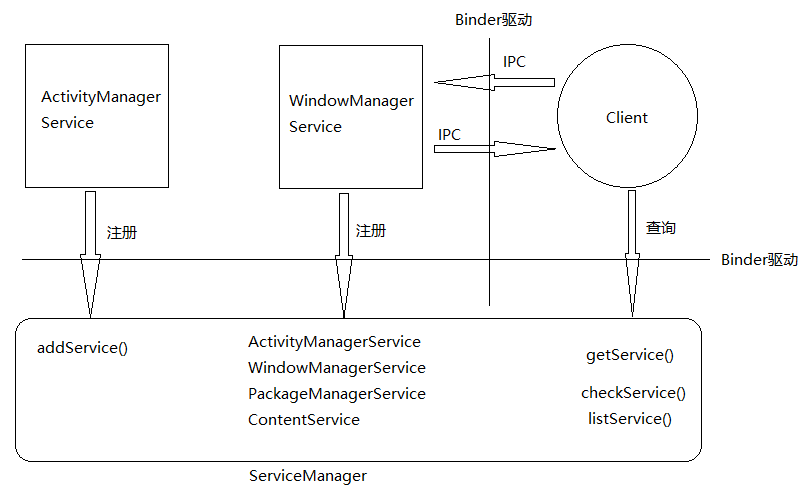


ActivityManagerService

Launcher，也是一个App

## ServiceManager

- addServiceManager()
- getServiceManager()
- listServiceManager()
- checkServiceManager()

ActivityManagerService、PackageManagerService、WindowManagerService、ContentService

## Binder对象引用计数技术

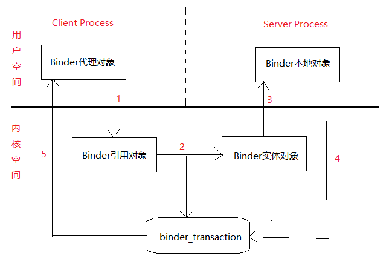


## PackageManagerService

系统在启动时，会启动一个Package管理服务PackageManagerService，并且通过它来安装系统中的应用程序。

是用来获取Apk包的信息的。Android系统使用PMS解析这个Apk中的manifest文件


## App启动流程

1. Launcher通知AMS，要启动斗鱼App，而且指定要启动斗鱼的哪个页面（也就是首页）。
2. AMS通知Launcher，好了我知道了，没你什么事了，同时，把要启动的首页记下来。
3. Launcher当前页面进入Paused状态，然后通知AMS，我睡了，你可以去找斗鱼App了。
4. AMS检查斗鱼App是否已经启动了。是，则唤起斗鱼App即可。否，就要启动一个新的进程。AMS在新进程中创建一个ActivityThread对象，启动其中的main函数。
5. 斗鱼App启动后，通知AMS，说我启动好了。
6. AMS翻出之前在第二步存的值，告诉斗鱼App，启动哪个页面。
7. 斗鱼App启动首页，创建Context并与首页Activity关联。然后调用首页Activity的onCreate函数。


- Launcher.startActivitySafely()
- Activity.startActivity()
- Activity.startActivityForResult()
- Instrumentation.execStartActivity()
- ActivityManagerProxy.startActivity()

 


## Activity跳转流程

 从ActivityA跳转到ActivityB，其实可以把ActivityA看作是Launcher，那么这个跳转过程，和App的启动过程就很像了。

有了前面的分析基础，会发现，这个过程不需要重新启动一个新的进程，所以可以省略App启动过程中的一些步骤，流程简化为：

​      1）ActivityA向AMS发送一个启动ActivityB的消息。

​      2）AMS保存ActivityB的信息，然后通知App，你可以休眠了（onPaused）。

​      3）ActivityA进入休眠，然后通知AMS，我休眠了。

​      4）AMS发现ActivityB所在的进程就是ActivityA所在的进程，所以不需要重新启动新的进程，所以它就会通知App，启动ActivityB。

​      5）App启动ActivityB。


## Instrumentation

仪表盘

- execStartActivity()
- newActivity()

## Zygote进程和System进程的启动过程

Zygote进程孵化器，加载内核 --> 启动init进程 --> 启动Zygote进程（socket），复制自身的方式创建进程

System进程：运行系统关键服务，在ServerThread中通过各种service的main()方法把服务启动起来，并通过ServiceManager.addService()把服务注册到ServiceManager中

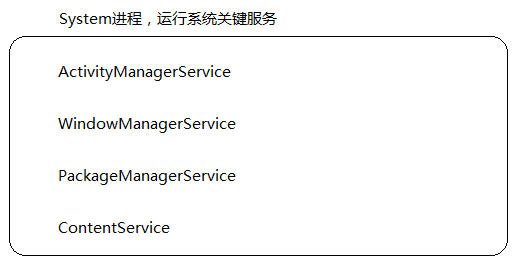

## Binder线程池