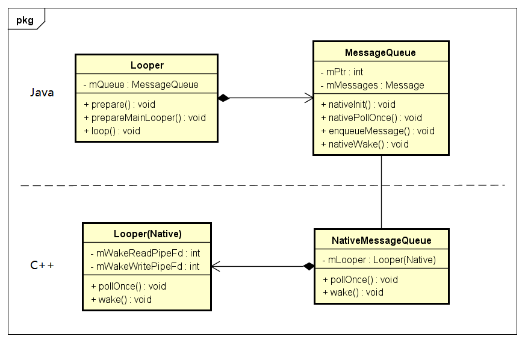

## 消息处理机制

Handler：消息处理器，发送消息，处理消息

- sendMessage()
- sendMessageDelay()
- sendEmptyMessage()
- sendEmptyMessageDelay()
- handleMessage()

Looper：消息轮询器，创建MessageQueue，轮询消息

- prepare()
- prepareMainLooper()
- loop()

MessageQueue：消息队列，存储消息

- 链表的数据结构
- enqueueMessage()
- next()

Message：消息，数据的载体

- obtain()

Looper(Native)

- 管道Pipe
- 读端文件描述符
- 写端文件描述符

ActivityThread 代表主线程

- main() 入口函数，调用了Looper.prepareMainLooper()和Looper.loop()，创建主线程的MessageQueue

ThreadLocal

- 线程范围内共享数据，存储线程对应的Looper