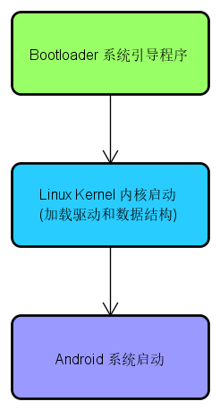
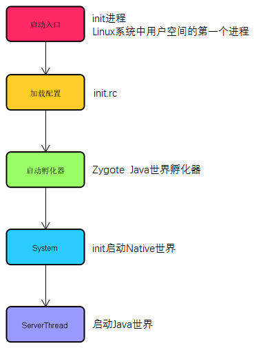
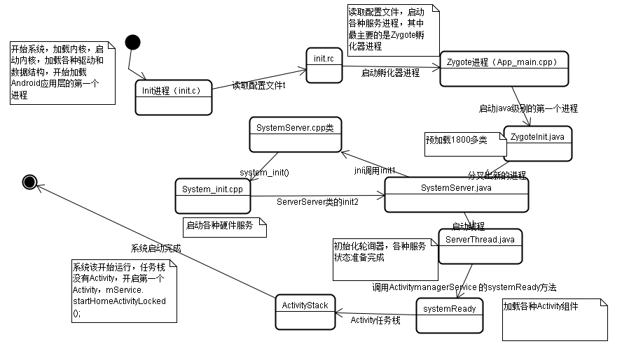
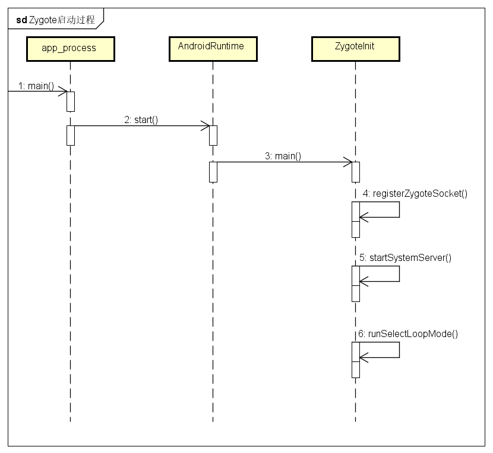
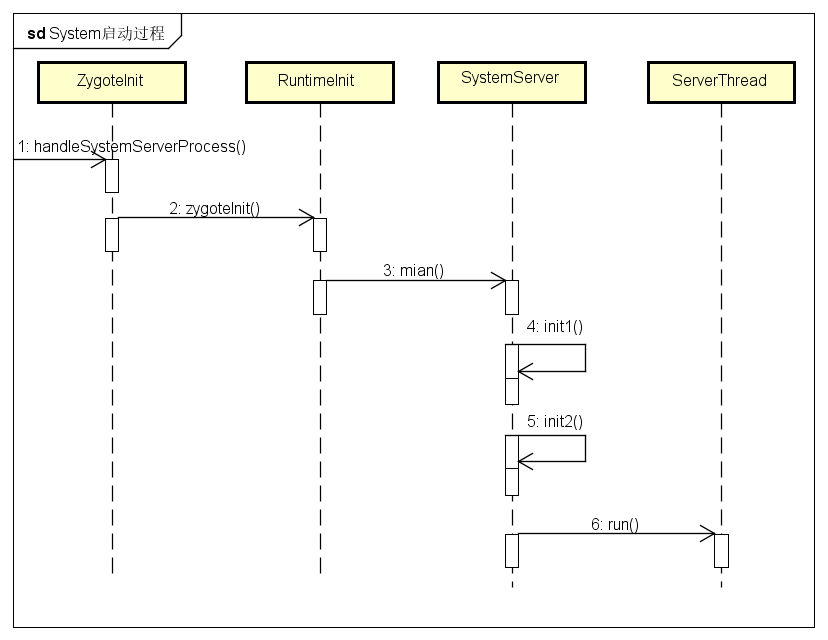
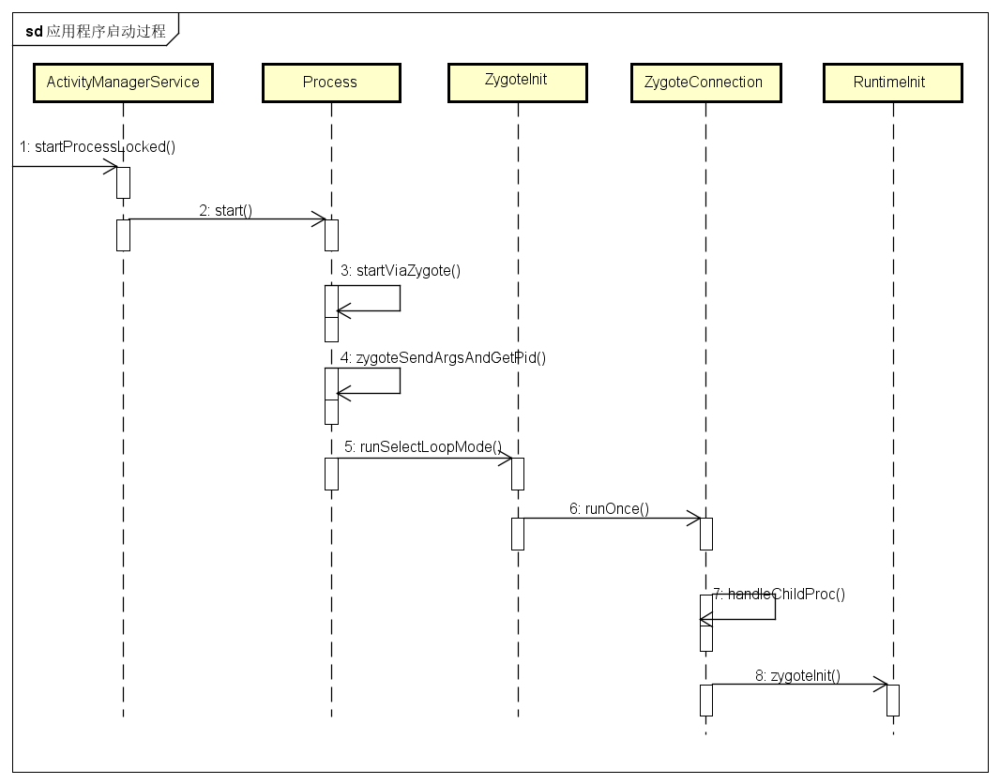
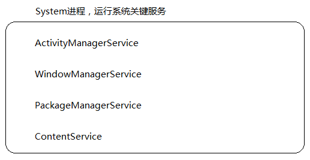

## Zygote进程和System进程的启动过程

在Android系统中，所有的应用程序进程，以及用来运行关键系统服务的System进程都是由Zygote进程负责创建的，因此，我们将它称为进程孵化器。Zygote进程是通过复制自身的方式来创建System进程和应用程序进程的。由于Zygote进程在启动的时候会在内部创建一个虚拟机实例，因此通过复制Zygote进程而得到的System进程和应用程序进程可以快速的在内部获得一个虚拟机实例拷贝。

Zygote进程在启动完成之后，会马上将System进程启动起来，以便它可以将系统的关键服务启动起来。这些关键服务包括：ActivityManagerService，WindowManagerService、PackageManagerService、ContentService。

Zygote进程是由Android系统的第一个进程init启动起来的。init进程是在内核加载完成之后就启动起来的，它在启动的过程中，会读取根目录下的一个脚本文件init.rc，以便可以将其他需要开机启动的进程也一起启动起来。

 

Zygote进程孵化器

1. 加载内核（各种驱动和数据结构）
2. 启动init进程
3. 读取配置文件init.rc
4. 启动Zygote进程，创建Socket，用来执行进程间通信，运行在System进程的ActivityManagerService就是通过这个Socket来请求Zygote进程创建新的应用程序进程的
5. 启动System进程
   - SystemServer.main()
   - SystemServer.init1() 启动C++语言开发的系统服务
   - SystemServer.init2() 启动java语言开发的系统服务 new ServerThread().start()
6. ServerThread
   - 在run方法中启动系统服务ActivityManagerService、WindowManagerService、PackageManagerService、ContentService，并通过ServiceManager.addService()把系统服务注册到ServiceManager中
   - ActivityManagerService.main()
   - PackageManagerService.main()
   - ContentService.main()
   - WindowManagerService.main()
   - ServiceManager.addService()

Zygote启动过程

System启动过程

应用程序启动过程

System进程：运行系统关键服务，在ServerThread中通过各种service的main()方法把服务启动起来，并通过ServiceManager.addService()把服务注册到ServiceManager中

